# Fundamentos de Programación de Sistemas con Rust

> Documento consolidado del curso. Recopila la introducción general y los materiales de las 8 partes: fundamentos, utilidades Unix, procesos e hilos, pipes y señales, sincronización, problemas clásicos de concurrencia, red, y estilo funcional.

---

## Tabla de contenidos

- [Introducción: Programación de sistemas desde la perspectiva de Rust](#introduccion-programacion-de-sistemas-desde-la-perspectiva-de-rust)
- [Parte 1 — Las cuatro piezas de la programación de sistemas en Rust](#parte-1--las-cuatro-piezas-de-la-programacion-de-sistemas-en-rust)
- [Parte 2 — Comandos Unix/Linux en Rust](#parte-2--comandos-unixlinux-en-rust)
- [Parte 3 — Procesos e hilos en Rust](#parte-3--procesos-e-hilos-en-rust)
- [Parte 4 — Pipes y señales en Rust](#parte-4--pipes-y-senales-en-rust)
- [Parte 5 — Sincronización entre hilos en Rust](#parte-5--sincronizacion-entre-hilos-en-rust)
- [Parte 6 — Problemas clásicos de concurrencia en Rust](#parte-6--problemas-clasicos-de-concurrencia-en-rust)
- [Parte 7 — Programación de red (sockets TCP) en Rust](#parte-7--programacion-de-red-sockets-tcp-en-rust)
- [Parte 8 — Programación funcional en Rust (opcional)](#parte-8--programacion-funcional-en-rust-opcional)

---

## Introducción: Programación de sistemas desde la perspectiva de Rust

### ¿Qué es la programación de sistemas?

La programación de sistemas es escribir software que interactúa directamente con el hardware y el sistema operativo. No es hacer una app con botones ni una página web — es construir lo que está debajo: kernels, drivers, bases de datos, servidores de red, compiladores, sistemas embebidos.

El programador de sistemas trabaja con lo que el sistema operativo expone: bytes, descriptores de archivo, memoria, procesos, señales, sockets. No hay capas de abstracción que te protejan. Si algo sale mal, no hay excepción bonita — hay un segfault, corrupción de memoria o un bug silencioso que aparece tres meses después.

Históricamente, este territorio ha sido de C y C++. Rust entra como alternativa con una propuesta clara: darte el mismo nivel de control, pero con garantías que antes no existían.

Este documento describe qué es la programación de sistemas a través de lo que realmente se construye en este curso: desde buffers de bytes hasta servidores HTTP, pasando por utilidades Unix, procesos, hilos, sincronización y problemas clásicos de concurrencia.

---

### Las piezas fundamentales

Casi todo programa de sistemas se construye combinando estos elementos:

#### 1. Buffers de bytes

El sistema operativo no entiende de strings, JSON ni objetos. Entiende bytes. Cuando lees un archivo, recibes bytes. Cuando envías datos por un socket, envías bytes. Cuando un dispositivo te manda información, llegan bytes.

Un buffer es simplemente un bloque de memoria donde almacenas esos bytes temporalmente mientras los procesas.

En C esto es un `unsigned char[]` o un `void*` con un tamaño. El problema: nada te impide leer más allá del final del buffer, escribir donde no debes, o usar el buffer después de liberarlo.

En Rust, un buffer puede ser:

- `Vec<u8>` — dinámico, crece según necesites, el compilador sabe cuándo liberarlo.
- `[u8; N]` — fijo, tamaño conocido en compilación, vive en el stack.
- `&[u8]` — un slice, una vista a bytes que viven en otro lado, con tamaño conocido.

```rust
// Buffer dinámico — recorre bytes y decide si son imprimibles
let buffer: Vec<u8> = vec![72, 101, 108, 108, 111, 10, 0, 255];
for byte in &buffer {
    if *byte >= 32 && *byte <= 126 {
        println!("ASCII imprimible: {}", *byte as char);
    }
}

// Buffer fijo — llena de a bloques, como harías en C
let mut buf = [0u8; 4];
let mut usados = 0;
```

En el curso, los buffers fijos aparecen desde el primer ejemplo (`01_buffer.rs`, `02_buffer_fijo.rs`) y reaparecen constantemente: en la lectura binaria hexadecimal de `od` (`06_od.rs`), en la recepción de datos por socket (`01_cliente.rs`, `02_servidor.rs`), y en el servidor echo (`04_net_echo.rs`) donde un `[0u8; 512]` recibe y reenvía bytes en un loop.

Rust garantiza en compilación que no puedes acceder fuera de los límites de un slice, que no puedes usar un buffer después de moverlo, y que no puedes tener dos partes del código modificándolo al mismo tiempo.

#### 2. Texto

Muchos de esos bytes resultan ser texto: líneas de log, rutas de archivo, comandos, configuraciones, respuestas HTTP. El programa necesita interpretar bytes como texto, manipularlo y producir texto nuevo.

En C, un string es un `char*` terminado en null. No sabes su longitud sin recorrerlo, no sabes si es UTF-8 válido, y funciones como `sprintf` y `strcat` son fuente constante de vulnerabilidades.

Rust separa el texto en dos tipos:

- `&str` — texto prestado, inmutable, garantizado UTF-8. Puede apuntar a un literal en el binario o a parte de un `String`.
- `String` — texto con dueño, vive en el heap, puede crecer y modificarse.

```rust
let modulo: &str = "net";                      // prestado, vive en el binario
let log = format!("[INFO] modulo={} fd={}", modulo, 3); // String, construido en runtime
```

No existe el null terminator. La longitud siempre es conocida. Y si intentas crear un `&str` con bytes que no son UTF-8, el compilador o el runtime te lo impiden.

En el curso, el texto aparece en el logging (`03_logging_str.rs`), en las utilidades Unix que procesan líneas (`cat`, `head`, `tail`, `wc`, `cut`), en el análisis de logs (`09_integrado.rs`), y en el parseo de peticiones HTTP del servidor web (`httpd.rs`) donde se separan método, ruta y versión con `split_whitespace()`.

#### 3. Estado y manejo de errores

Un programa de sistemas no es una función pura que recibe datos y devuelve un resultado. Tiene estado: ¿el socket está abierto o cerrado? ¿La operación anterior falló? ¿En qué fase del protocolo estamos?

En C, el estado se maneja con enteros, `#define`, banderas de bits, o convenciones informales. Un file descriptor es un `int`. Un error es `-1`. Un puntero inválido es `NULL`. Nada en el tipo te dice qué valores son válidos ni qué significan.

Rust usa el sistema de tipos para hacer el estado explícito:

```rust
enum EstadoFd {
    Abierto,
    Cerrado,
    Error(i32),   // el código de error viaja dentro del tipo
}
```

`match` te obliga a manejar todos los casos posibles. Si agregas una variante nueva, el código no compila hasta que la atiendas en cada `match`. No hay fall-through como en `switch` de C — cada brazo es independiente. Y `match` puede extraer datos de las variantes (destructuring), algo que `switch` no puede hacer.

Para operaciones que pueden fallar, Rust tiene `Result<T, E>` (éxito o error) y `Option<T>` (valor presente o ausente). No hay `-1` mágico ni `NULL` — el tipo mismo te dice que algo puede no estar ahí.

```rust
fn buscar_byte(buffer: &[u8], buscado: u8) -> Option<usize> {
    for (i, b) in buffer.iter().enumerate() {
        if *b == buscado { return Some(i); }
    }
    None
}
```

En el curso, `match` y `Result` aparecen en prácticamente todos los programas. El ejemplo integrador (`09_integrado.rs`) clasifica líneas de log con un `enum NivelLog` y `match`. La versión sin `unwrap` (`09_integrado_sin_unwrap.rs`) muestra cómo propagar errores con `?` en lugar de hacer panic. Las utilidades Unix usan `match` sobre `reader.lines()` para separar lectura exitosa de error. Y el servidor HTTP (`httpd.rs`) usa `match` para despachar métodos HTTP y manejar cada posible fallo.

#### 4. Handles de recurso

El programa no vive solo en memoria. Abre archivos, crea sockets, lanza procesos, mapea memoria. Cada uno de estos es un recurso del sistema operativo que debe abrirse, usarse y cerrarse correctamente.

En C, un recurso es un entero (file descriptor) o un puntero opaco. Olvidar cerrarlo es un leak. Usarlo después de cerrarlo es undefined behavior. Cerrarlo dos veces es otro bug.

En Rust, los recursos son valores con dueño. Cuando el valor sale de scope, el recurso se libera automáticamente (RAII). No necesitas `close()` explícito — el compilador lo hace por ti.

```rust
use std::fs::File;
use std::path::Path;

let ruta = Path::new("datos.txt");
match File::open(ruta) {
    Ok(archivo) => { /* usar archivo */ }
    Err(e) => println!("Error: {}", e),
}
// archivo se cierra automáticamente aquí
```

`File` no es un entero — es un tipo que encapsula el recurso, garantiza su limpieza, y no te deja usarlo después de cerrarlo porque el sistema de ownership lo impide.

En el curso, RAII aparece con archivos (`06_buffer_archivo.rs`), con conexiones TCP (`TcpStream` en los servidores y clientes de la parte 7), con procesos hijos (`Command::spawn()` en la parte 3), y con mutex guards (`MutexGuard` se libera al salir del scope, desbloqueando el candado automáticamente).

---

### Interacción con el sistema operativo

La programación de sistemas no es solo manipular datos en memoria — es hablar con el sistema operativo. El curso cubre las interfaces fundamentales que todo sistema Unix expone.

#### Utilidades de línea de comandos

Las herramientas clásicas de Unix (`cat`, `head`, `tail`, `wc`, `cut`, `echo`, `od`) son programas de sistemas en su forma más pura: leen bytes de stdin o de un archivo, los procesan, y escriben el resultado en stdout. Son el ejemplo perfecto de cómo un programa interactúa con el sistema operativo a través de flujos de datos.

En el curso se implementan todas estas utilidades en Rust:

- `cat` — lee archivo o stdin línea por línea, usando generics (`T: BufRead`) para abstraer la fuente.
- `head` — lee las primeras N líneas con un contador y `break`.
- `tail` — mantiene las últimas N líneas en un `Vec<String>` como buffer FIFO.
- `wc` — cuenta líneas, palabras y bytes usando iteradores (`lines()`, `split_whitespace()`, `len()`).
- `cut` — extrae columnas separando por espacios con `split_whitespace()`.
- `od` — volcado hexadecimal con lectura binaria en bloques de 16 bytes.
- `echo` — imprime argumentos de línea de comandos.

Cada una de estas utilidades demuestra un patrón diferente de programación de sistemas: lectura con buffer, procesamiento línea por línea, manejo de argumentos, lectura binaria cruda, y la decisión entre stdin y archivo como fuente de datos.

#### Procesos

En Unix, un proceso es la unidad fundamental de ejecución. Crear procesos hijos, conectarlos con pipes, y esperar su terminación es pan de cada día en programación de sistemas.

En C, esto es `fork()` + `exec()` + `wait()` + `pipe()`. En Rust, `Command` encapsula todo eso con una API más segura:

```rust
// Lanzar un proceso y esperar su resultado
let status = Command::new("ls").arg("-l").arg("/tmp").status()?;

// Conectar stdin/stdout con pipes
let mut child = Command::new("wc")
    .arg("-c")
    .stdin(Stdio::piped())
    .stdout(Stdio::piped())
    .spawn()?;
child.stdin.as_mut().unwrap().write_all(b"hola rust\n")?;
let output = child.wait_with_output()?;
```

En el curso, los procesos aparecen desde la parte 3 (`01_proceso.rs`, `02_proceso_con_pipe.rs`) y se extienden en la parte 4 con pipelines de múltiples etapas: `echo hola | wc -c` y `cat archivo | grep foo | wc -l`. Estos pipelines son exactamente lo que hace el shell cuando escribes comandos encadenados con `|`.

#### Señales

Las señales son el mecanismo que tiene Unix para notificar eventos a los procesos: Ctrl+C envía SIGINT, `kill` envía SIGTERM, un segfault genera SIGSEGV. Un programa de sistemas necesita capturar estas señales para hacer un apagado limpio (graceful shutdown) en lugar de morir abruptamente.

En el curso se muestran dos enfoques:

```rust
// Con AtomicBool: un flag compartido entre el manejador y el loop principal
let running = Arc::new(AtomicBool::new(true));
ctrlc::set_handler(move || { r.store(false, Ordering::SeqCst); }).unwrap();
while running.load(Ordering::SeqCst) {
    thread::sleep(Duration::from_millis(100));
}

// Con signal_hook + canal: el manejador envía un mensaje y el main espera
let (tx, rx) = mpsc::channel();
// hilo que escucha SIGINT y SIGTERM y envía () por el canal
rx.recv().unwrap(); // bloquea hasta recibir la señal
println!("Shutdown limpio");
```

Ambos patrones son fundamentales en servidores, daemons y cualquier programa que necesite liberar recursos antes de terminar.

---

### Concurrencia: hilos y sincronización

La concurrencia es donde la programación de sistemas se pone seria. Múltiples flujos de ejecución accediendo a los mismos datos es la fuente de los bugs más difíciles de encontrar y reproducir: data races, deadlocks, starvation.

#### Hilos (threads)

Un hilo es un flujo de ejecución dentro del mismo proceso. Comparten memoria, lo cual es eficiente pero peligroso.

```rust
let h = thread::spawn(|| {
    println!("hilo secundario");
});
h.join().unwrap(); // esperar a que termine
```

La palabra clave `move` transfiere la propiedad de las variables capturadas al hilo. Esto es fundamental: el hilo puede vivir más que el scope donde nació, así que Rust exige que posea sus datos en vez de colgar de referencias potencialmente inválidas.

```rust
let saludo = String::from("hola desde el padre");
let h = thread::spawn(move || {
    println!("{saludo}"); // saludo ahora pertenece a este hilo
});
// println!("{saludo}"); // ERROR: saludo fue movido
```

En el curso, los hilos aparecen desde la parte 3 y se usan extensivamente: en el pipeline por canales (`03_pipeline_threads.rs`), en los servidores concurrentes (un hilo por conexión en `03_servidor_multihilo.rs` y `04_net_echo.rs`), y en todos los problemas clásicos de concurrencia de la parte 6.

#### Primitivas de sincronización

Cuando múltiples hilos necesitan acceder al mismo dato, se necesitan mecanismos de sincronización. El curso cubre los cuatro fundamentales:

**Mutex** — exclusión mutua. Solo un hilo accede al dato a la vez. `lock()` adquiere el candado, y el `MutexGuard` lo libera automáticamente al salir del scope.

```rust
let contador = Arc::new(Mutex::new(0));
// en cada hilo:
let mut n = contador.lock().unwrap();
*n += 1;
// el candado se libera aquí (RAII)
```

**RwLock** — candado de lectura/escritura. Múltiples lectores simultáneos O un solo escritor exclusivo. Ideal cuando muchos leen y pocos escriben.

```rust
let dato = Arc::new(RwLock::new(10));
// lectores: dato.read().unwrap()  — pueden ser varios a la vez
// escritor: dato.write().unwrap() — exclusivo
```

**Condvar** — variable de condición. Permite que un hilo duerma sin consumir CPU hasta que otro lo despierte. Se usa siempre junto con un Mutex.

```rust
// consumidor espera:
while !*listo {
    listo = cvar.wait(listo).unwrap(); // libera el lock, duerme, re-adquiere al despertar
}
// productor señaliza:
*listo = true;
cvar.notify_one();
```

**Canales (mpsc)** — paso de mensajes. En lugar de compartir estado protegido por candados, los hilos se comunican enviando datos por un canal. El dato se mueve, no se comparte.

```rust
let (tx, rx) = mpsc::channel();
thread::spawn(move || { tx.send("hola").unwrap(); });
let msg = rx.recv().unwrap(); // bloquea hasta recibir
```

En el curso, los canales se usan para construir pipelines internos (`03_pipeline_threads.rs`), para el patrón productor-consumidor (`01_productor_consumidor.rs`), y para recibir señales del sistema operativo (`05_signals_hilos.rs`).

#### Problemas clásicos de concurrencia

La parte 6 del curso implementa los problemas clásicos que todo programador de sistemas debe conocer:

**Productor-Consumidor** — un hilo genera datos, otro los procesa, con un buffer en medio. En C requiere mutex + dos semáforos. En Rust, `mpsc::channel()` resuelve todo: actúa como buffer, bloquea al consumidor cuando está vacío, y el dato se mueve eliminando condiciones de carrera.

**Lectores-Escritores** — muchos hilos leen un dato compartido, ocasionalmente uno lo modifica. `RwLock` encapsula toda la lógica que en C requiere mutex + contadores + semáforos.

**Filósofos Comensales** — 5 filósofos, 5 tenedores, cada uno necesita dos para comer. Demuestra el riesgo de deadlock: si todos toman el tenedor izquierdo al mismo tiempo, nadie puede tomar el derecho. La implementación del curso usa `Mutex` por tenedor y muestra explícitamente dónde puede ocurrir el deadlock.

**Barbero Dormilón** — una barbería con capacidad limitada, un barbero que duerme cuando no hay clientes, y clientes que se van si no hay silla. Combina `Mutex`, `Condvar` y `VecDeque` como cola FIFO. Es el ejemplo más complejo del curso y demuestra cómo coordinar múltiples condiciones: despertar al barbero, verificar capacidad, cerrar la barbería limpiamente.

---

### Programación de red

La red es donde todo lo anterior converge. Un servidor de red necesita buffers para recibir y enviar datos, texto para parsear protocolos, estado para manejar conexiones, handles para gestionar sockets, hilos para atender múltiples clientes, y sincronización para coordinar el acceso a recursos compartidos.

#### Cliente y servidor TCP

En C: `socket()` → `bind()` → `listen()` → `accept()` → `read()` → `write()` → `close()`. En Rust, `TcpListener` y `TcpStream` encapsulan todo eso:

```rust
// Servidor: escuchar y aceptar conexiones
let listener = TcpListener::bind("127.0.0.1:7878")?;
for stream in listener.incoming() {
    // manejar cada conexión
}

// Cliente: conectar, enviar, recibir
let mut stream = TcpStream::connect("127.0.0.1:7878")?;
stream.write_all(b"Hola servidor\n")?;
let n = stream.read(&mut buffer)?;
```

El curso progresa desde un servidor secuencial (`02_servidor.rs`) que atiende un cliente a la vez, hasta un servidor concurrente (`03_servidor_multihilo.rs`) con un hilo por conexión, un servidor echo (`04_net_echo.rs`) que devuelve todo lo que recibe, y finalmente un servidor HTTP (`httpd.rs`) que parsea peticiones, resuelve rutas de forma segura contra directory traversal, y sirve archivos HTML estáticos.

#### El servidor HTTP como ejemplo integrador

El servidor HTTP del curso (`httpd.rs`) es el ejemplo más completo de programación de sistemas porque integra todo:

- **Buffers**: `BufReader` para leer la petición línea por línea.
- **Texto**: parseo de la request line (`GET /index.html HTTP/1.1`) con `split_whitespace()`.
- **Estado**: `match` sobre el método HTTP para despachar GET, rechazar POST/PUT/DELETE, y manejar errores 400, 404, 403, 500, 501.
- **Handles**: `TcpStream` se cierra automáticamente, `File` para leer archivos del disco.
- **Seguridad**: validación de rutas contra directory traversal rechazando componentes `..`, rutas absolutas y prefijos de unidad.
- **Concurrencia**: un hilo por conexión con `thread::spawn`.

---

### Lo que Rust cambia respecto a C

Rust no cambia qué haces — sigues trabajando con bytes, texto, estado, recursos del sistema, procesos, hilos y sockets. Lo que cambia es cómo lo haces:

| Concepto | C | Rust |
|---|---|---|
| Buffer | `char buf[1024]`, sin verificación de límites | `[u8; 1024]` o `Vec<u8>`, verificado en compilación |
| Texto | `char*` con null terminator | `&str` / `String`, UTF-8 garantizado, longitud conocida |
| Estado | Enteros, `#define`, convenciones | `enum`, `Option`, `Result`, verificado por el compilador |
| Recursos | File descriptors enteros, `close()` manual | Tipos con ownership, liberación automática (RAII) |
| Errores | `-1`, `NULL`, `errno` | `Result<T, E>`, `Option<T>`, el compilador te obliga a manejarlos |
| Memoria | `malloc`/`free`, sin verificación | Ownership + borrowing, verificado en compilación |
| Procesos | `fork()` + `exec()` + `wait()` | `Command::new().spawn()`, pipes con `Stdio::piped()` |
| Hilos | `pthread_create`, data races posibles | `thread::spawn` + `move`, data races imposibles en compilación |
| Sincronización | `pthread_mutex_lock/unlock` manual | `Mutex`, `RwLock`, `Condvar` con RAII (se desbloquean solos) |
| Red | `socket()` + `bind()` + `listen()` + `close()` | `TcpListener::bind()`, `TcpStream`, cierre automático |

---

### Ownership y borrowing: la idea central

Todo lo anterior funciona gracias a una idea que no existe en C ni en la mayoría de lenguajes: cada valor en Rust tiene exactamente un dueño.

- Cuando el dueño sale de scope, el valor se libera.
- Puedes prestar el valor con `&` (referencia inmutable) o `&mut` (referencia mutable).
- No puedes tener una referencia mutable y otra inmutable al mismo tiempo.
- No puedes usar un valor después de moverlo.

Estas reglas se verifican en compilación. No hay garbage collector, no hay runtime. El costo es cero en ejecución. El precio es que el compilador te rechaza código que en C compilaría sin quejarse — pero que en C tendría bugs.

```rust
let saludo = String::from("hola");
let h = thread::spawn(move || {
    println!("{saludo}"); // saludo fue movido aquí
});
// println!("{saludo}"); // ERROR: ya no es tuyo
```

Este mecanismo es lo que hace posible que Rust prevenga data races en tiempo de compilación. Si un hilo es dueño de un dato, ningún otro hilo puede acceder a él. Si necesitas compartir, usas `Arc` (propiedad compartida atómica) + `Mutex` o `RwLock` (acceso sincronizado). El compilador te obliga a elegir explícitamente cómo compartir, y verifica que lo hagas correctamente.

---

### El recorrido del curso

El curso construye conocimiento de forma progresiva, cada parte apoyándose en la anterior:

1. **Fundamentos** — buffers, texto, enums, match, Option, Result, archivos, paths. Las piezas básicas con las que se construye todo lo demás.
2. **Utilidades Unix** — cat, echo, head, tail, cut, od, wc. Programas reales que procesan flujos de datos, leen argumentos y manejan errores.
3. **Procesos e hilos** — lanzar comandos, conectar pipes, crear hilos, transferir ownership con `move`.
4. **Pipelines y señales** — encadenar procesos con tuberías, construir pipelines internos con canales, capturar SIGINT/SIGTERM para apagado limpio.
5. **Sincronización** — Mutex, RwLock, Condvar, canales. Las herramientas para que múltiples hilos cooperen sin corromperse.
6. **Problemas clásicos** — productor-consumidor, lectores-escritores, filósofos comensales, barbero dormilón. Los problemas que todo programador de sistemas debe saber resolver.
7. **Red** — cliente TCP, servidor secuencial, servidor concurrente, servidor echo, servidor HTTP. La culminación donde todo converge.

---

### ¿Para quién es la programación de sistemas en Rust?

Para quien necesita control sobre la máquina sin sacrificar seguridad. Rust no es más fácil que C — en muchos sentidos es más exigente, porque el compilador te obliga a pensar en cosas que en C simplemente ignorabas. Pero los bugs que previene (use-after-free, buffer overflow, data races, deadlocks por RAII) son exactamente los que causan las vulnerabilidades más graves y los bugs más difíciles de encontrar en software de sistemas.

Rust te deja pensar a bajo nivel — bytes, memoria, procesos, hilos, sockets — pero con un compilador que actúa como un revisor de código implacable que nunca se cansa.

---

## Parte 1 — Las cuatro piezas de la programación de sistemas en Rust

En la programación de sistemas, casi todo se construye con cuatro piezas fundamentales:

1. **Buffers de bytes** — el sistema operativo entrega y recibe datos como bytes.
2. **Texto** — muchas veces esos bytes representan líneas, comandos, rutas o logs.
3. **Estado** — el programa necesita recordar en qué situación está y qué ha pasado.
4. **Handles de recurso** — el programa abre archivos, usa sockets, lanza procesos y trabaja con recursos del sistema operativo.

Rust no inventa esas cuatro piezas; lo que hace es volverlas más explícitas, más seguras y más claras.

Si entendemos bien esas cuatro, ya tenemos el esqueleto de casi cualquier programa de sistemas: un echo, un cat, un servidor TCP, un parser de logs o una herramienta de línea de comandos.

### Buffer de bytes

La estructura más elemental en sistemas es el buffer de bytes.

Un buffer de bytes es simplemente una región de memoria que contiene datos crudos: lo que llegó de un archivo, de un socket, de stdin o lo que vamos a enviar a stdout. En este nivel todavía no sabemos si eso representa texto, una imagen, un paquete de red o un número binario. Son solamente bytes.

En C, esto solía verse como:

```c
char buf[1024];
// o:
unsigned char buf[1024];
```

En Rust, las formas típicas son:

```rust
let buf: [u8; 1024];
let v: Vec<u8>;
let slice: &[u8];
```

Aquí hay una diferencia importante. En Rust, el tipo deja más claro qué clase de acceso tenemos:

- `[u8; 1024]` es un arreglo de tamaño fijo
- `Vec<u8>` es un buffer dinámico, que puede crecer
- `&[u8]` es una vista prestada sobre bytes
- `&mut [u8]` es una vista mutable sobre bytes

Eso ya nos enseña una lección muy propia de Rust: no basta con saber qué datos tengo; también importa saber quién los posee y quién puede modificarlos.

**Idea clave para el taller:** En programación de sistemas, el buffer de bytes es la materia prima. Primero llegan o salen bytes. Después decidimos cómo interpretarlos.

### Texto

La segunda estructura es el texto.

En sistemas, muchas cosas terminan siendo texto: comandos, rutas de archivos, logs, encabezados HTTP, líneas de configuración, nombres de usuarios. Pero aquí conviene insistir en algo fundamental: **texto no es lo mismo que bytes**.

El texto es una interpretación de los bytes. En Rust, esa diferencia está muy bien marcada. Los tipos principales son:

- `String` es texto propio, almacenado dinámicamente
- `&str` es una vista prestada sobre texto UTF-8 válido

Eso significa que en Rust no cualquier buffer de bytes puede tratarse como texto alegremente. Primero hay que verificar que realmente sea UTF-8 válido, o usar una conversión apropiada.

Ese detalle es valioso para enseñar programación de sistemas, porque obliga a pensar con disciplina:

- si estoy leyendo de un socket, primero tengo bytes
- si quiero imprimirlos como texto, tengo que interpretarlos como texto
- si no son texto válido, debo tratarlos como binario

En C muchas veces esa frontera era borrosa. En Rust, en cambio, queda más clara y eso evita errores clásicos.

**Idea clave para el taller:** El texto en Rust no es un "char buffer con otro nombre". Es una estructura con reglas precisas. Y eso es bueno, porque en sistemas la confusión entre bytes y texto suele causar bugs muy viejos y muy conocidos.

### Estado

La tercera estructura es el estado.

Todo programa de sistemas mantiene estado. Por ejemplo:

- cuántos bytes se han leído
- en qué fase está un protocolo
- si un archivo está abierto o cerrado
- si una conexión sigue activa
- cuál fue el último error
- qué modo eligió el usuario con una bandera de línea de comandos

En C, el estado a veces estaba disperso entre variables sueltas:

```c
int connected = 1;
int bytes_read = 0;
int mode = 2;
```

En Rust, aunque también puede haber variables simples, es muy natural representar el estado con `struct`, `enum` y `match`.

Por ejemplo, en lugar de usar enteros mágicos para representar fases, podemos escribir algo como:

```rust
enum EstadoConexion {
    Esperando,
    Conectado,
    Cerrado,
}
```

Esto es una maravilla para explicar sistemas, porque muchos programas de bajo nivel son en realidad máquinas de estados: esperar entrada, procesar entrada, responder, cerrar recurso, manejar error.

Rust ayuda mucho aquí porque hace natural modelar el estado de manera explícita. Y cuando el estado está explícito, el programa se entiende mejor.

**Idea clave para el taller:** Programar sistemas no es solo mover bytes. También es mantener el control del estado del programa: saber dónde estoy, qué tengo abierto, qué ya procesé y qué falta por hacer.

### Handle de recurso

La cuarta estructura es el handle de recurso.

En sistemas no trabajamos solamente con datos en memoria. Trabajamos con recursos del sistema operativo: archivos, sockets, pipes, procesos, mutexes, directorios.

En Unix clásico, un ejemplo típico era el file descriptor, un entero como 3, 4 o 5.

En Rust, en cambio, normalmente usamos valores con tipo, por ejemplo:

- `std::fs::File`
- `std::net::TcpStream`
- `std::process::Child`

Eso cambia mucho la manera de enseñar. En lugar de decir "tengo un entero que representa algo abierto", podemos decir: tengo un valor que representa la posesión o el acceso a un recurso del sistema.

Y aquí aparece una de las ideas más bonitas de Rust: cuando el valor sale de alcance, Rust suele liberar el recurso automáticamente mediante `Drop`. Es decir, el lenguaje hace natural algo que en C dependía mucho de la disciplina del programador: abrir, usar, cerrar.

En Rust, esa disciplina sigue existiendo, pero queda mucho mejor apoyada por el modelo del lenguaje.

**Idea clave para el taller:** Un handle de recurso no es solo un dato. Es un valor que representa una relación viva con el sistema operativo.

### En resumen

En la programación de sistemas, casi todo se construye con cuatro piezas fundamentales.

Primero, **buffers de bytes**, porque el sistema operativo entrega y recibe datos como bytes.
Luego, **texto**, porque muchas veces esos bytes representan líneas, comandos, rutas o logs.
Después, **estado**, porque el programa necesita recordar en qué situación está y qué ha pasado hasta ahora.
Y finalmente, **handles de recurso**, porque el programa no vive solo en memoria: abre archivos, usa sockets, lanza procesos y trabaja con recursos del sistema operativo.

Rust no inventa esas cuatro piezas; lo que hace es volverlas más explícitas, más seguras y más claras.

### Programas

#### 01_buffer.rs — Buffer dinámico de bytes
Crea un `Vec<u8>` con bytes crudos y recorre cada uno con `for`. Usa `if` para decidir si un byte es ASCII imprimible o un carácter de control.

**Pieza:** buffers de bytes.
**Conceptos:** `Vec<u8>`, `&buffer` (préstamo), `*byte` (desreferencia), rango ASCII imprimible.

#### 02_buffer_fijo.rs — Buffer fijo con variable de control
Simula la lectura de bytes en un buffer de tamaño fijo `[u8; 4]`, llenándolo y vaciándolo manualmente con un contador `usados`. Muy cercano a cómo se trabaja en C.

**Pieza:** buffers de bytes.
**Conceptos:** `b"..."` (byte string literal), `[0u8; 4]` (array fijo), slices (`&buf[..usados]`), `String::from_utf8_lossy`.

#### 03_logging_str.rs — Logging con texto
Construye una línea de log usando `format!` a partir de `&str` y la imprime si supera una longitud mínima.

**Pieza:** texto.
**Conceptos:** `&str` (texto prestado, vive en el binario), `String` (texto con dueño, vive en el heap), `format!`, `.len()`.

#### 04_enum_estado.rs — Estado del sistema con enum y match
Define un enum `EstadoFd` con variantes `Abierto`, `Cerrado` y `Error(i32)` para representar el estado de un file descriptor. Usa `match` para manejar cada caso.

**Pieza:** estado.
**Conceptos:** `enum` con datos asociados, `match` exhaustivo, destructuring (`Error(codigo)`), diferencias con `switch`.

#### 05_option_resultado.rs — Búsqueda con Option
Busca un byte dentro de un buffer y retorna `Option<usize>`: `Some(pos)` si lo encuentra, `None` si no. Reemplaza la convención de C de retornar `-1` o `NULL`.

**Pieza:** estado + buffers de bytes.
**Conceptos:** `Option<T>`, `Some`/`None`, `.iter().enumerate()`, `match` sobre `Option`.

#### 06_buffer_archivo.rs — Lectura desde archivo o stdin
Lee líneas desde la entrada estándar o desde un archivo, clasificándolas con `match`. Usa una función genérica con el trait `BufRead` para aceptar ambas fuentes.

**Pieza:** handles de recurso + texto.
**Conceptos:** `File::open`, `BufReader`, `stdin.lock()`, generics con traits (`T: BufRead`), `.lines()`, `match` sobre `Result`.

#### 07_uso_path.rs — Apertura de archivo con Path
Abre un archivo usando `Path` en lugar de un string crudo. Maneja el resultado con `match` para distinguir éxito de error.

**Pieza:** handles de recurso.
**Conceptos:** `Path::new`, `File::open`, `match` sobre `Result<File, Error>`.

#### 08_uso_match.rs — Clasificación de bytes con match
Clasifica bytes individuales en categorías (NUL, fin de línea, ASCII imprimible, otro) usando `match` con patrones de rango y alternativas.

**Pieza:** buffers de bytes + estado.
**Conceptos:** `match` con rangos (`32..=126`), alternativas (`10 | 13`), comodín (`_`).

#### 09_integrado.rs — Ejemplo integrador: analizador de logs
Lee `sistema.log` línea por línea, clasifica cada entrada por nivel de severidad (`INFO`, `WARN`, `ERROR`) usando un enum y `match`, y muestra un resumen con conteos al final.

**Pieza:** las cuatro juntas — buffers, texto, estado y handles de recurso.
**Conceptos:** `enum`, `match`, `File::open`, `BufReader`, `.lines()`, contadores mutables.

#### 09_integrado_sin_unwrap.rs — Integrador sin unwrap
Misma lógica que `09_integrado.rs`, pero reemplaza los `unwrap()` por el operador `?` para propagar errores de forma segura. La lógica se mueve a una función que retorna `Result`.

**Pieza:** las cuatro juntas + manejo de errores idiomático.
**Conceptos:** `Result<(), std::io::Error>`, operador `?`, `eprintln!`, separación entre lógica y `main`.

### Cómo compilar y ejecutar

```bash
# Compilar un programa individual
rustc 01_buffer.rs -o bin/01_buffer

# Ejecutar
./bin/01_buffer

# Para 09_integrado, asegúrate de tener sistema.log en el mismo directorio
rustc 09_integrado.rs -o bin/09_integrado
./bin/09_integrado
```

---

## Parte 2 — Comandos Unix/Linux en Rust

El objetivo de esta parte es ilustrar, con ejemplos simples, cómo se construyen utilidades clásicas de línea de comandos al estilo Unix/Linux usando Rust.

Cada programa reimplementa un comando conocido en su forma más básica. La idea no es replicar todas las opciones del comando original, sino mostrar los patrones de programación de sistemas que hay detrás: leer stdin, procesar líneas, manejar argumentos, trabajar con bytes crudos.

### Programas

#### 01_cat.rs — Imprimir archivo o stdin
Replica `cat`. Si recibe un archivo como argumento, imprime su contenido. Si no, lee desde stdin. Permite encadenar con pipes.

```bash
./01_cat archivo.txt
echo "hola" | ./01_cat
```

**Conceptos:** `env::args()`, `File::open`, `BufReader`, generics con `BufRead`, `match` sobre `Result`.

#### 02_echo.rs — Imprimir argumentos
Replica `echo`. Toma los argumentos de la línea de comandos, los une con espacios y los imprime.

```bash
./02_echo hola mundo
# Salida: hola mundo
```

**Conceptos:** `env::args().skip(1)`, `enumerate()`, `print!` vs `println!`, control de formato con `if`.

#### 03_head.rs — Primeras N líneas
Replica `head -n 5`. Lee desde stdin e imprime solo las primeras 5 líneas.

```bash
cat archivo.txt | ./03_head
```

**Conceptos:** contador como variable de control, `if` + `break`, patrón clásico de lectura limitada.

#### 04_tail.rs — Últimas N líneas
Replica `tail -n 5`. Lee toda la entrada y muestra solo las últimas 5 líneas usando un buffer tipo FIFO.

```bash
cat archivo.txt | ./04_tail
```

**Conceptos:** `Vec<String>` como buffer de ventana deslizante, `push` + `remove(0)` para comportamiento FIFO.

#### 05_cut.rs — Seleccionar columnas
Replica `cut` simplificado. Divide cada línea por espacios en blanco y extrae la columna indicada.

```bash
echo "hola mundo cruel" | ./05_cut
# Salida: mundo  (columna 1, índice base 0)
```

**Conceptos:** `split_whitespace()`, `Vec<&str>`, verificación de límites antes de acceder por índice.

#### 06_od.rs — Volcado hexadecimal
Replica `od -x` / `hexdump`. Lee bytes crudos desde stdin y los muestra en formato hexadecimal, 16 por línea.

```bash
echo "Hola" | ./06_od
# Salida: 48 6f 6c 61 0a
```

**Conceptos:** buffer fijo `[u8; 16]`, lectura binaria con `Read::read`, formato `{:02x}`, loop con `match` sobre `Ok(0)` para detectar EOF.

#### 07_wc.rs — Contar líneas, palabras y bytes
Replica `wc`. Lee toda la entrada y muestra el conteo de líneas, palabras y bytes.

```bash
cat archivo.txt | ./07_wc
# Salida: 10 42 256
```

**Conceptos:** `read_to_string`, `.lines().count()`, `.split_whitespace().count()`, `.len()` para bytes.

### Cómo compilar y ejecutar

```bash
# Compilar
rustc 01_cat.rs -o bin/01_cat

# Ejecutar con archivo
./bin/01_cat archivo.txt

# Ejecutar con pipe
echo "hola mundo" | ./bin/01_cat
```

### Patrón común

Todos los programas siguen la misma estructura que las utilidades Unix reales:

1. Leer desde stdin o un archivo
2. Procesar línea por línea (o bloque por bloque)
3. Escribir el resultado en stdout
4. Reportar errores en stderr

Esto permite encadenarlos con pipes, exactamente como sus equivalentes en un shell real.

---

## Parte 3 — Procesos e hilos en Rust

### El concepto

En un sistema operativo, hay dos formas de ejecutar código de forma concurrente:

#### Procesos

Un proceso es un programa en ejecución con su propio espacio de memoria, sus propios file descriptors y su propio estado. Cuando lanzas `ls` desde la terminal, el sistema operativo crea un proceso nuevo, completamente aislado del que lo invocó.

Los procesos se comunican entre sí a través de mecanismos del sistema operativo: pipes, archivos, sockets, señales. No comparten memoria directamente.


En C, crearías un proceso con `fork()` + `exec()`. En Rust, usas `Command::new()` que abstrae esa mecánica de forma más segura.

#### Hilos (Threads)

Un hilo es un flujo de ejecución dentro del mismo proceso. Todos los hilos comparten el mismo espacio de memoria, pero cada uno tiene su propio stack y su propio punto de ejecución.

Son más ligeros que los procesos (crear un hilo es mucho más barato que crear un proceso) y la comunicación entre ellos es más rápida porque comparten memoria.

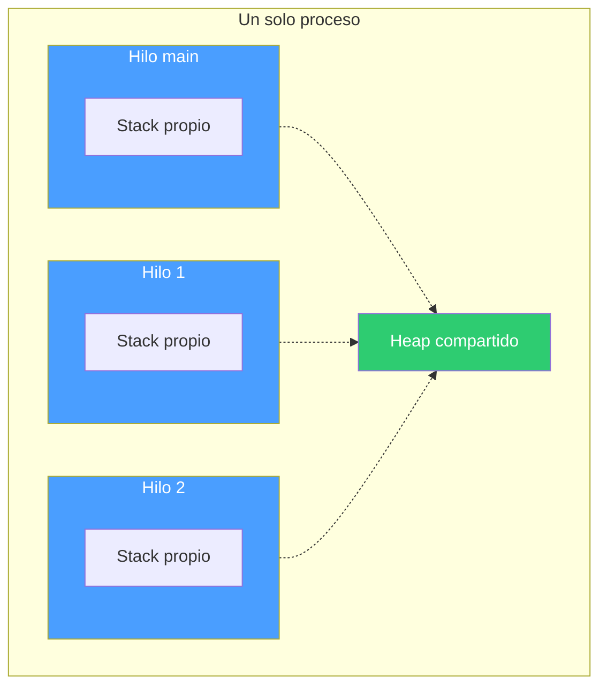

El problema clásico de los hilos es que compartir memoria es peligroso: data races, lecturas de datos a medio escribir, corrupción silenciosa. En C, esto se maneja con mutex y disciplina del programador. En Rust, el sistema de ownership previene data races en compilación.

#### Procesos vs Hilos

| | Proceso | Hilo |
|---|---|---|
| Memoria | Aislada (cada uno la suya) | Compartida (mismo heap) |
| Comunicación | Pipes, sockets, archivos | Variables compartidas, canales |
| Costo de creación | Alto | Bajo |
| Seguridad | Aislamiento natural | Requiere sincronización |
| Fallo | Un proceso muere sin afectar otros | Un hilo en panic puede afectar al proceso |

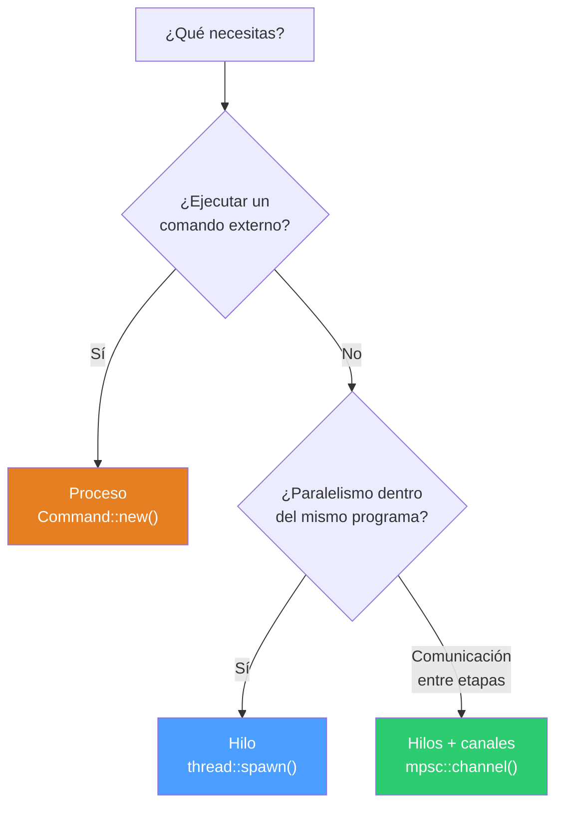

### Programas

#### 01_proceso.rs — Lanzar un comando externo
Ejecuta `ls -l /tmp` como proceso hijo usando `Command::new()` y muestra su código de salida. Es el equivalente Rust de `fork()` + `exec()` en C.

```bash
./01_proceso
```

**Conceptos:** `Command::new`, `.arg()`, `.status()`, `ExitStatus`, propagación de errores con `?`.

#### 02_proceso_con_pipe.rs — Comunicación entre procesos con pipe
Lanza `wc -c` como proceso hijo, le envía datos por stdin a través de un pipe, y lee el resultado desde stdout. Demuestra IPC (Inter-Process Communication) al estilo Unix.

```bash
./02_proceso_con_pipe
# Salida: salida de wc: 10
```

**Conceptos:** `Stdio::piped()`, `write_all()`, `wait_with_output()`, cierre implícito de stdin por drop.

#### 03_thread.rs — Crear un hilo
Crea un hilo secundario que corre en paralelo con el hilo principal. Ambos imprimen mensajes intercalados gracias a `thread::sleep`. Demuestra concurrencia básica.

```bash
./03_thread
# Salida intercalada de "main: N" y "hilo: N"
```

**Conceptos:** `thread::spawn`, closures, `JoinHandle`, `join()`, `Duration`, concurrencia.

#### 04_move.rs — Transferir ownership a un hilo
Muestra por qué `move` es necesario al pasar datos a un hilo. El hilo toma ownership del `String`, y el hilo principal ya no puede usarlo después.

```bash
./04_move
# Salida: hilo dice: hola desde el padre
```

**Conceptos:** `move`, ownership en closures, por qué Rust exige `move` con hilos, prevención de data races en compilación.

#### 05_move_multihilos.rs — Múltiples hilos con move
Crea 3 hilos en un loop, cada uno captura su variable `i` con `move`. Usa un `Vec<JoinHandle>` para esperar a que todos terminen.

```bash
./05_move_multihilos
# Salida (orden puede variar):
# soy el hilo 0
# soy el hilo 1
# soy el hilo 2
```

**Conceptos:** `Vec<JoinHandle>`, `move` en loop, `join()` secuencial, concurrencia con múltiples hilos.

### Documentos complementarios

- **closures.md** — Qué son los closures, cómo capturan variables, `move`, los traits `Fn`/`FnMut`/`FnOnce`.
- **mpsc.md** — Canales de comunicación entre hilos: `Sender`, `Receiver`, múltiples productores, `sync_channel`.

### Cómo compilar y ejecutar

```bash
# Compilar
rustc 01_proceso.rs -o bin/01_proceso

# Ejecutar
./bin/01_proceso
```

### Progresión

Los programas siguen una progresión natural:

1. Lanzar un proceso externo (como haría un shell)
2. Conectar procesos con pipes (como `|` en la terminal)
3. Crear hilos dentro del mismo programa
4. Pasar datos a hilos con `move`
5. Manejar múltiples hilos concurrentes

De procesos aislados a hilos que comparten el mismo espacio — con Rust garantizando seguridad en cada paso.

---

## Parte 4 — Pipes y señales en Rust

### Pipes (tuberías)

Un pipe es un mecanismo del sistema operativo que conecta la salida de un proceso con la entrada de otro. Es la base del operador `|` en la terminal:

```bash
echo hola | wc -c
```

Internamente, el sistema operativo crea un buffer en memoria con dos extremos: uno de escritura y uno de lectura. El primer proceso escribe bytes en un extremo, el segundo los lee del otro.


Características clave:
- Los datos fluyen en una sola dirección (unidireccional)
- El pipe se cierra cuando el escritor termina (EOF)
- Si el lector es más lento, el escritor se bloquea (backpressure natural)
- Los datos son bytes crudos — no tienen estructura

En Rust, `Command` con `Stdio::piped()` crea estos pipes programáticamente, replicando lo que el shell hace con `|`.

#### De procesos a hilos

El mismo patrón de pipeline se puede implementar dentro del mismo programa usando hilos y canales `mpsc`. En lugar de bytes crudos entre procesos, pasamos valores tipados entre hilos:

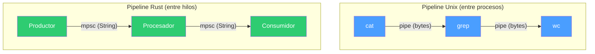

### Señales (signals)

Las señales son notificaciones asíncronas que el sistema operativo envía a un proceso. Son el mecanismo más básico de comunicación entre el kernel (o entre procesos) y tu programa.

Las más comunes:

| Señal | Número | Origen | Significado |
|---|---|---|---|
| `SIGINT` | 2 | Ctrl+C en la terminal | "Interrumpe lo que estás haciendo" |
| `SIGTERM` | 15 | `kill <pid>` | "Termina limpiamente" |
| `SIGKILL` | 9 | `kill -9 <pid>` | "Muere ahora" (no se puede capturar) |
| `SIGHUP` | 1 | Terminal se cierra | "Tu terminal desapareció" |

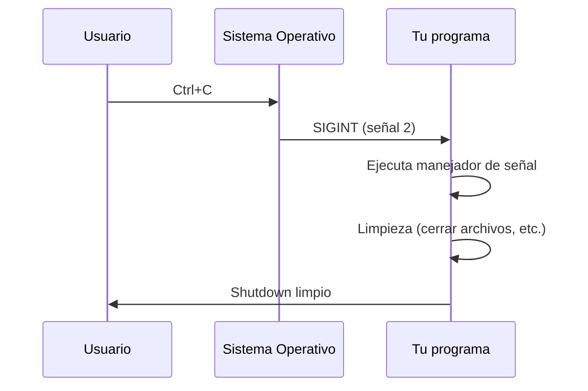

Sin un manejador registrado, `SIGINT` y `SIGTERM` matan el proceso inmediatamente. Registrar un manejador te permite hacer limpieza antes de salir: cerrar conexiones, guardar estado, liberar recursos.

#### Dos enfoques en Rust

**Con `ctrlc`** (04_signals.rs) — usa un `AtomicBool` compartido entre el manejador y el hilo principal:

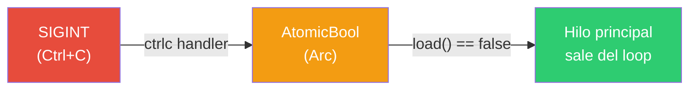

**Con `signal_hook`** (05_signals_hilos.rs) — usa un hilo dedicado que escucha señales y notifica por canal `mpsc`:


### Programas

#### 01_simple_pipeline.rs — Pipe entre dos procesos
Replica `echo hola | wc -c` conectando dos procesos con `Stdio::piped()`.

```bash
cargo run --bin 01_simple_pipeline
# Salida: 5
```

**Conceptos:** `Command::new`, `Stdio::piped()`, `.stdout.take()`, `.spawn()` vs `.output()`.

#### 02_tres_pipeline.rs — Pipeline de tres etapas
Replica `cat archivo.txt | grep foo | wc -l` encadenando tres procesos.

```bash
cargo run --bin 02_tres_pipeline
```

**Conceptos:** encadenamiento de pipes, tres procesos conectados, `.take().unwrap()` para transferir ownership del pipe.

#### 03_pipeline_threads.rs — Pipeline con hilos y mpsc
Mismo patrón de pipeline pero dentro del programa: un hilo produce, otro transforma, el principal consume. Usa canales `mpsc` en lugar de pipes del SO.

```bash
cargo run --bin 03_pipeline_threads
# Salida: UNO DOS TRES
```

**Conceptos:** `mpsc::channel()`, `thread::spawn`, `move`, paso de mensajes entre hilos.

#### 04_signals.rs — Capturar Ctrl+C con ctrlc
Registra un manejador de SIGINT usando el crate `ctrlc`. Usa un `AtomicBool` compartido con `Arc` para comunicar la señal al hilo principal.

```bash
cargo run --bin 04_signals
# Presiona Ctrl+C → "Recibí SIGINT"
```

**Conceptos:** `ctrlc::set_handler`, `Arc<AtomicBool>`, `Ordering::SeqCst`, polling con `thread::sleep`.

#### 05_signals_hilos.rs — Señales con hilo dedicado y mpsc
Escucha SIGINT y SIGTERM en un hilo separado usando `signal_hook`. Cuando llega una señal, notifica al hilo principal a través de un canal `mpsc`.

```bash
cargo run --bin 05_signals_hilos
# Presiona Ctrl+C → "Shutdown limpio"
```

**Conceptos:** `signal_hook::iterator::Signals`, hilo dedicado para señales, comunicación por canal, shutdown limpio.

### Documentos complementarios

- **mpsc.md** — Canales de comunicación entre hilos (sender, receiver, múltiples productores).
- **cargo.md** — Qué es Cargo, cómo funciona `Cargo.toml`, comandos esenciales.

### Cómo compilar y ejecutar

Esta parte usa Cargo porque los programas de señales dependen de crates externos (`ctrlc`, `signal-hook`).

```bash
# Compilar todo
cargo build --release

# Compilar uno específico
cargo build --release --bin 04_signals

# Ejecutar directamente
cargo run --bin 04_signals
```

### Progresión

1. Conectar procesos con pipes (como hace el shell)
2. Encadenar tres procesos en un pipeline
3. Replicar el pipeline con hilos y canales dentro del programa
4. Capturar señales del SO para shutdown limpio
5. Combinar señales, hilos y canales en un patrón robusto

---

## Parte 5 — Sincronización entre hilos en Rust

### El concepto

Cuando múltiples hilos comparten datos o necesitan coordinarse, se requieren mecanismos de sincronización. Sin ellos, los hilos pueden leer datos a medio escribir, sobrescribirse mutuamente, o quedarse esperando para siempre.

Dentro de un proceso, Rust ofrece tres estrategias:

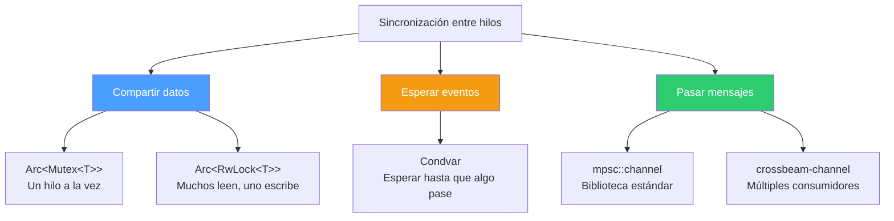

#### Compartir datos: `Arc<Mutex<T>>`, `Arc<RwLock<T>>`

Cuando varios hilos necesitan acceder al mismo dato, lo envuelves en un `Arc` (para compartir ownership entre hilos) y un lock (para controlar el acceso):

- `Mutex<T>` — exclusión mutua. Solo un hilo accede a la vez, ya sea para leer o escribir. Simple y seguro.
- `RwLock<T>` — candado de lectura/escritura. Múltiples lectores simultáneos, pero solo un escritor a la vez. Mejor rendimiento cuando las lecturas son mucho más frecuentes que las escrituras.

#### Esperar eventos: `Condvar`

Una variable de condición permite que un hilo se duerma hasta que otro hilo le avise que algo cambió. Evita el polling activo (estar preguntando en un loop "¿ya pasó?").

#### Pasar mensajes: `mpsc`, `crossbeam-channel`

En lugar de compartir memoria, los hilos se envían datos a través de canales. El dato se mueve del emisor al receptor — no hay memoria compartida, no hay data races.

- `mpsc::channel` — de la biblioteca estándar. Múltiples productores, un solo consumidor.
- `crossbeam-channel` — crate externo. Soporta múltiples productores y múltiples consumidores, con mejor rendimiento.

### ¿Cuándo usar cada uno?

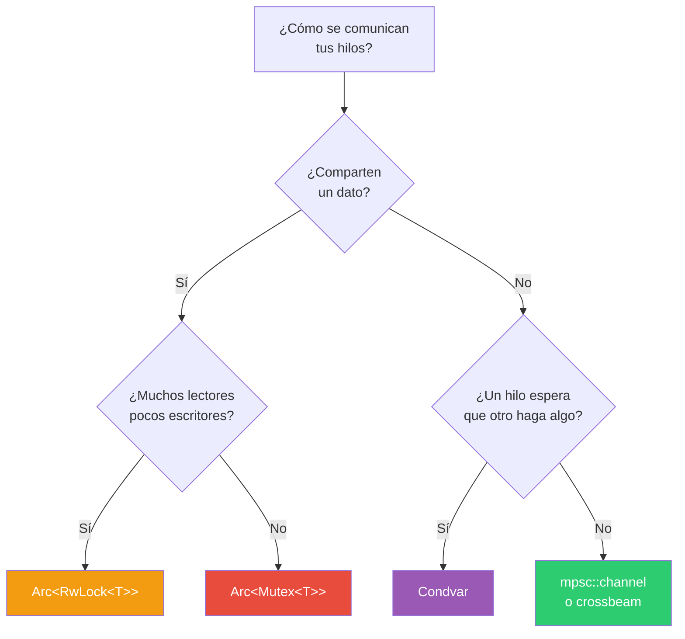

### Programas

#### 01_mutex.rs — Contador compartido con Mutex
10 hilos incrementan un contador compartido protegido por `Arc<Mutex<i32>>`. Cada hilo adquiere el lock, incrementa, y lo libera automáticamente al salir del scope.

```bash
rustc 01_mutex.rs -o bin/01_mutex
./bin/01_mutex
# Salida: contador = 10
```

**Conceptos:** `Arc::new`, `Arc::clone`, `Mutex::new`, `.lock().unwrap()`, `MutexGuard` y RAII.

#### 02_rw_lock.rs — Lectores y escritor con RwLock
Dos hilos lectores y un hilo escritor acceden al mismo dato. Los lectores usan `.read()` (pueden ser simultáneos), el escritor usa `.write()` (acceso exclusivo).

```bash
rustc 02_rw_lock.rs -o bin/02_rw_lock
./bin/02_rw_lock
```

**Conceptos:** `Arc<RwLock<T>>`, `.read()` vs `.write()`, acceso concurrente de lectura, orden no determinista.

#### 03_condvar.rs — Esperar un evento con Condvar
Un hilo productor espera 500ms y luego señaliza un evento. Un hilo consumidor se duerme con `cvar.wait()` hasta que el productor lo despierte con `cvar.notify_one()`.

```bash
rustc 03_condvar.rs -o bin/03_condvar
./bin/03_condvar
# Salida (después de ~500ms): Evento recibido
```

**Conceptos:** `Arc<(Mutex<bool>, Condvar)>`, `wait()` con guard, `notify_one()`, evitar polling activo.

#### 04_channels.rs — Paso de mensajes con mpsc
Un hilo hijo envía un mensaje al hilo principal a través de un canal `mpsc`. El hilo principal se bloquea en `recv()` hasta que llega el mensaje.

```bash
rustc 04_channels.rs -o bin/04_channels
./bin/04_channels
# Salida: recibido: hola desde thread hijo
```

**Conceptos:** `mpsc::channel()`, `tx.send()`, `rx.recv()`, `move` para transferir el sender al hilo.

### Documentos complementarios

- **arc.md** — Qué es `Arc`, cómo funciona el conteo de referencias atómico, diferencia con `Rc`.
- **ipc_unix.md** — Mecanismos de comunicación entre procesos en Unix (pipes, señales, sockets, memoria compartida).

### Cómo compilar y ejecutar

Estos programas solo usan la biblioteca estándar, así que se pueden compilar con `rustc` directamente:

```bash
rustc 01_mutex.rs -o bin/01_mutex
./bin/01_mutex
```

### Progresión

1. `Mutex` — el candado más básico, un hilo a la vez
2. `RwLock` — optimización para muchos lectores
3. `Condvar` — esperar eventos sin polling
4. `mpsc` — comunicación sin memoria compartida

De lo más restrictivo (un hilo a la vez) a lo más desacoplado (mensajes sin estado compartido).

---

## Parte 6 — Problemas clásicos de concurrencia en Rust

### El concepto

Estos son los cuatro problemas clásicos que aparecen en cualquier curso de sistemas operativos. Cada uno ilustra un patrón diferente de sincronización entre hilos y los bugs que pueden surgir si no se manejan correctamente: condiciones de carrera, deadlock, starvation.

Rust no elimina estos problemas por arte de magia — pero su sistema de tipos hace que muchos errores comunes sean imposibles de compilar.

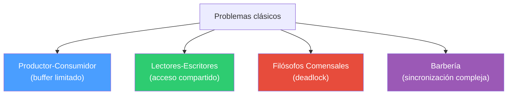

### 01_productor_consumidor.rs — Productor-Consumidor

#### El problema

Un productor genera datos, un consumidor los procesa, y hay un buffer en medio. Los riesgos clásicos:
- El productor escribe cuando el buffer está lleno
- El consumidor lee cuando el buffer está vacío
- Condiciones de carrera si ambos acceden al buffer al mismo tiempo


#### La solución en Rust

```rust
use std::sync::mpsc;
use std::thread;

fn main() {
    let (tx, rx) = mpsc::channel();

    thread::spawn(move || {
        for i in 0..5 {
            tx.send(i).unwrap();
        }
    });

    for recibido in rx {
        println!("Consumido: {}", recibido);
    }
}
```

`mpsc::channel()` resuelve el problema de forma elegante:
- El canal actúa como buffer entre productor y consumidor
- `send()` nunca falla por buffer lleno (el canal es unbounded)
- `for recibido in rx` se bloquea automáticamente cuando no hay datos
- Cuando el productor termina y `tx` se destruye, el loop del consumidor termina
- No hay condiciones de carrera — el dato se **mueve** por el canal

En C, este problema requiere un buffer compartido protegido con mutex y dos semáforos (uno para "hay espacio" y otro para "hay datos"). En Rust, el canal lo resuelve en 10 líneas.

### 02_lectores_escritores.rs — Lectores-Escritores

#### El problema

Muchos hilos necesitan leer un dato compartido, pero ocasionalmente uno necesita escribir. Las reglas:
- Múltiples lectores pueden leer al mismo tiempo
- Solo un escritor puede escribir a la vez
- Nadie puede leer mientras se escribe

Los riesgos: starvation (un lado nunca accede porque el otro siempre tiene prioridad).

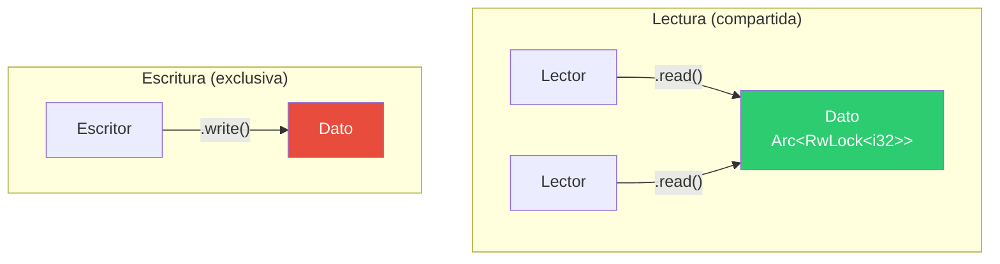

#### La solución en Rust

```rust
use std::sync::{Arc, RwLock};
use std::thread;

fn main() {
    let data = Arc::new(RwLock::new(5));

    let r = {
        let data = Arc::clone(&data);
        thread::spawn(move || {
            let val = data.read().unwrap();
            println!("lector: {}", *val);
        })
    };

    let w = {
        let data = Arc::clone(&data);
        thread::spawn(move || {
            let mut val = data.write().unwrap();
            *val += 1;
        })
    };

    r.join().unwrap();
    w.join().unwrap();
}
```

- `Arc::clone(&data)` — cada hilo obtiene su propia referencia al dato compartido
- `data.read().unwrap()` — adquiere un lock de lectura (múltiples lectores simultáneos)
- `data.write().unwrap()` — adquiere un lock de escritura (exclusivo, bloquea a todos)
- Los guards (`val`) se liberan automáticamente al salir del scope (RAII)

El orden de ejecución no es determinista: el lector puede ver `5` (si lee antes del escritor) o `6` (si lee después).

### 03_filosofos_comensales.rs — Filósofos Comensales

#### El problema

5 filósofos sentados en una mesa circular. Entre cada par hay un tenedor. Para comer, cada filósofo necesita los dos tenedores adyacentes. Los riesgos:
- **Deadlock**: todos toman el tenedor izquierdo al mismo tiempo y se quedan esperando el derecho para siempre
- **Starvation**: un filósofo nunca consigue ambos tenedores

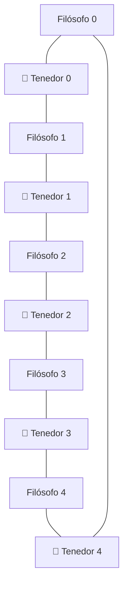

#### La solución en Rust

```rust
use std::sync::{Arc, Mutex};
use std::thread;

fn main() {
    let forks: Vec<_> = (0..5).map(|_| Arc::new(Mutex::new(()))).collect();

    let handles: Vec<_> = (0..5).map(|i| {
        let left = Arc::clone(&forks[i]);
        let right = Arc::clone(&forks[(i + 1) % 5]);

        thread::spawn(move || {
            let _l = left.lock().unwrap();
            let _r = right.lock().unwrap();
            println!("Filósofo {} comiendo", i);
        })
    }).collect();

    for h in handles {
        h.join().unwrap();
    }
}
```

Cada tenedor es un `Mutex<()>` — el valor no importa, solo el lock. Cada filósofo:
1. Toma el tenedor izquierdo (`left.lock()`)
2. Toma el tenedor derecho (`right.lock()`)
3. Come
4. Suelta ambos al salir del scope (RAII)

**Advertencia**: esta implementación puede hacer deadlock. Si los 5 filósofos toman su tenedor izquierdo al mismo tiempo, todos se quedan esperando el derecho. Soluciones clásicas:
- Que un filósofo tome los tenedores en orden inverso
- Usar un semáforo que limite a 4 filósofos intentando comer a la vez
- Usar `try_lock()` y soltar si no se consigue el segundo

### 04_barberia.rs — El Barbero Dormilón

#### El problema

Una barbería con un barbero y una sala de espera con sillas limitadas:
- Si no hay clientes, el barbero duerme
- Si llega un cliente y hay silla, se sienta y despierta al barbero
- Si no hay silla, el cliente se va
- El barbero atiende uno por uno

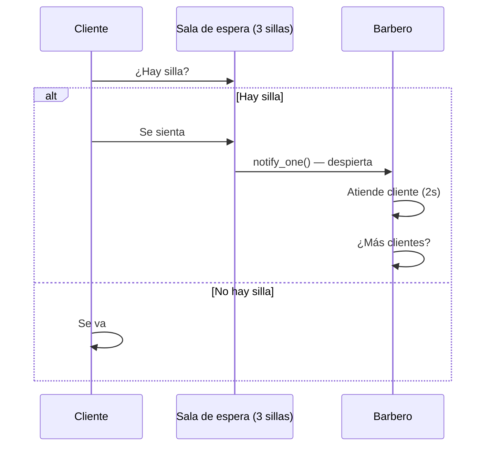

#### La solución en Rust

Este es el ejemplo más complejo. Usa `Arc<(Mutex<EstadoBarberia>, Condvar)>` para coordinar todo:

```rust
struct EstadoBarberia {
    sala_espera: VecDeque<Cliente>,  // cola FIFO de clientes
    capacidad: usize,                // número de sillas
    abierta: bool,                   // si la barbería sigue abierta
}
```

**El barbero** (función `barbero`):
- Adquiere el lock del estado
- Si no hay clientes y la barbería está abierta, se duerme con `cvar.wait()`
- Cuando lo despiertan, toma al siguiente cliente de la cola (`pop_front`)
- Lo atiende durante 2 segundos (simulado con `sleep`)
- Si la barbería cerró y no quedan clientes, termina

**Cada cliente** (función `cliente`):
- Adquiere el lock del estado
- Si hay silla disponible (`sala_espera.len() < capacidad`), se agrega a la cola y despierta al barbero con `cvar.notify_one()`
- Si no hay silla, se va

**El hilo principal**:
- Lanza el hilo del barbero
- Lanza 10 clientes que llegan escalonados (cada 300ms)
- Espera a que todos lleguen
- Cierra la barbería cambiando `abierta = false` y notificando al barbero

La `Condvar` es clave: evita que el barbero haga polling ("¿hay clientes? ¿hay clientes? ¿hay clientes?"). En su lugar, se duerme y solo despierta cuando un cliente lo notifica.

### Resumen de primitivas usadas

| Problema | Primitiva | Por qué |
|---|---|---|
| Productor-Consumidor | `mpsc::channel` | Paso de mensajes, sin estado compartido |
| Lectores-Escritores | `Arc<RwLock<T>>` | Lecturas concurrentes, escritura exclusiva |
| Filósofos | `Arc<Mutex<()>>` | Exclusión mutua sobre recursos (tenedores) |
| Barbería | `Arc<(Mutex<T>, Condvar)>` | Estado compartido + espera de eventos |

### Cómo compilar y ejecutar

```bash
rustc 01_productor_consumidor.rs -o bin/01_productor_consumidor
./bin/01_productor_consumidor

rustc 04_barberia.rs -o bin/04_barberia
./bin/04_barberia
```

---

## Parte 7 — Programación de red (sockets TCP) en Rust

### El concepto

Los sockets TCP son la base de casi toda la comunicación en red: HTTP, bases de datos, chat, transferencia de archivos. Un socket es un extremo de una conexión de red, identificado por una dirección IP y un puerto.

El flujo clásico en C es:
- **Cliente:** `socket()` → `connect()` → `write()` → `read()` → `close()`
- **Servidor:** `socket()` → `bind()` → `listen()` → `accept()` → `read()` → `write()` → `close()`

En Rust, `TcpStream` y `TcpListener` encapsulan todo esto. Los sockets implementan los traits `Read` y `Write`, así que se usan igual que un archivo. Y se cierran automáticamente al salir de scope (RAII).


#### Del servidor secuencial al concurrente

Un servidor secuencial atiende un cliente a la vez — mientras procesa uno, los demás esperan. Un servidor concurrente lanza un hilo por conexión, atendiendo múltiples clientes en paralelo:

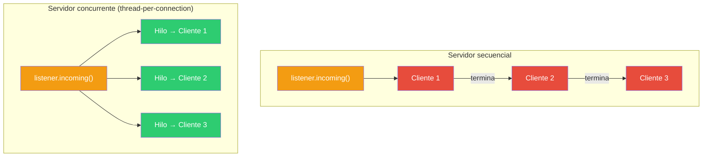

#### Del echo al HTTP

El servidor echo es el "Hello World" de la red: devuelve todo lo que recibe. El servidor HTTP agrega un protocolo sobre TCP: parsea la línea de petición, las cabeceras, y responde con un formato estructurado (status line + headers + body).

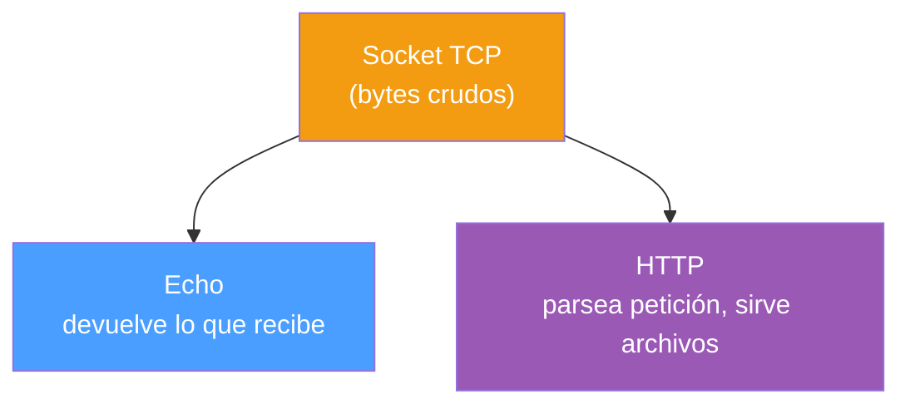

### Programas

#### 01_cliente.rs — Cliente TCP básico

Se conecta a un servidor en `127.0.0.1:7878`, envía `"Hola servidor\n"`, lee la respuesta y la imprime. Es la contraparte de `02_servidor.rs`.

```bash
rustc 01_cliente.rs -o bin/01_cliente
./bin/01_cliente
# Salida: Respuesta: Hola cliente
```

**Conceptos:** `TcpStream::connect()`, `write_all()` vs `write()`, `read()` con buffer fijo, `String::from_utf8_lossy()`, RAII (el stream se cierra al salir de scope).

#### 02_servidor.rs — Servidor TCP secuencial

Escucha en `127.0.0.1:7878` y atiende clientes uno por uno. Lee lo que el cliente envía, lo imprime, y responde con `"Hola cliente\n"`. Mientras atiende a un cliente, los demás esperan en la cola del SO.

```bash
rustc 02_servidor.rs -o bin/02_servidor
./bin/02_servidor
# En otra terminal: ./bin/01_cliente
```

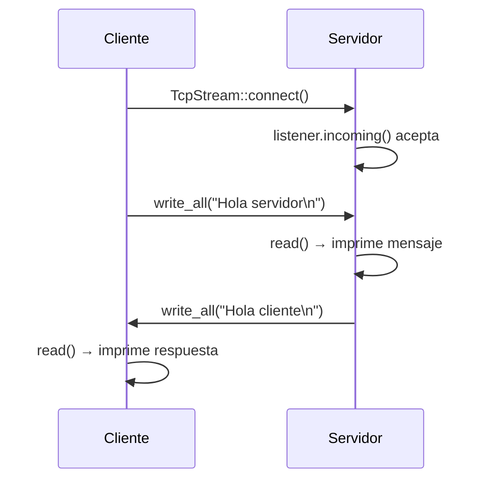

**Conceptos:** `TcpListener::bind()`, `listener.incoming()` (iterador infinito), `match` para manejar errores sin detener el servidor, función `manejar_cliente()` separada.

#### 03_servidor_multihilo.rs — Servidor TCP concurrente

Evolución del servidor secuencial: cada conexión se atiende en un hilo separado con `thread::spawn`. El hilo principal queda libre para aceptar nuevas conexiones inmediatamente.

```bash
rustc 03_servidor_multihilo.rs -o bin/03_servidor_multihilo
./bin/03_servidor_multihilo
# Conectar varios clientes simultáneamente
```

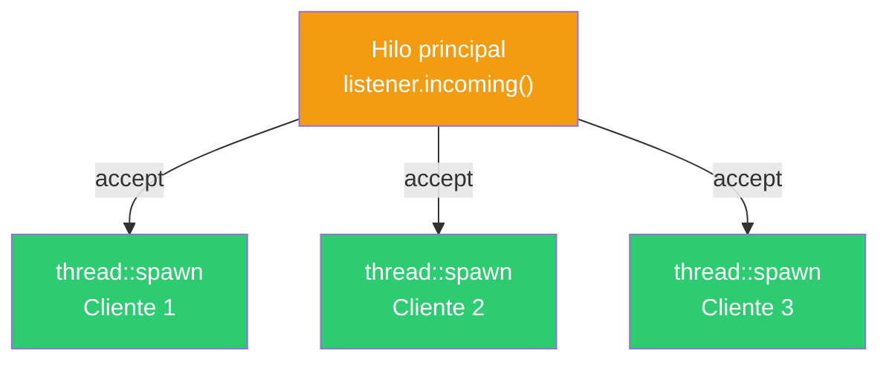

**Conceptos:** `thread::spawn(move || ...)`, `move` para transferir ownership del stream al hilo, `thread::current().id()` para identificar hilos, patrón thread-per-connection.

⚠️ Crear un hilo por conexión no escala con miles de clientes. Para eso se usan thread pools o async (tokio).

#### 04_net_echo.rs — Servidor Echo

El servidor echo devuelve todo lo que el cliente envía, byte por byte. Escucha en `127.0.0.1:9000` y atiende cada conexión en un hilo separado. El loop de echo termina cuando el cliente cierra la conexión (`read()` retorna 0).

```bash
rustc 04_net_echo.rs -o bin/04_net_echo
./bin/04_net_echo
# En otra terminal:
nc 127.0.0.1 9000
# Escribe algo → te lo devuelve
```

```mermaid
flowchart LR
    C["Cliente\n(nc / telnet)"] -->|"hola\n"| S["Servidor Echo"]
    S -->|"hola\n"| C

    style C fill:#4a9eff,color:#fff
    style S fill:#2ecc71,color:#fff
```

**Conceptos:** loop de lectura/escritura, detección de EOF (`n == 0`), `write_all(&buffer[..n])` para reenviar solo los bytes leídos, servidor concurrente con hilos.

#### simple_http/httpd.rs — Servidor HTTP minimalista

Un servidor HTTP completo que sirve archivos HTML estáticos desde el directorio `public/`. Escucha en `127.0.0.1:8080`, atiende cada conexión en un hilo, y soporta únicamente GET.

```bash
rustc simple_http/httpd.rs -o simple_http/httpd
# Ejecutar desde el directorio simple_http/
# Abrir http://127.0.0.1:8080 en el navegador
```

```mermaid
flowchart TB
    BROWSER["Navegador"] -->|"GET /index.html HTTP/1.1"| HTTPD["httpd.rs"]
    HTTPD --> PARSE["Parsear request line\nmétodo + ruta + versión"]
    PARSE --> RESOLVE["resolve_path()\nsanitizar ruta"]
    RESOLVE --> READ["fs::read()\nleer archivo"]
    READ --> RESP["send_response()\n200 OK + HTML"]
    RESP --> BROWSER

    style BROWSER fill:#4a9eff,color:#fff
    style HTTPD fill:#f39c12,color:#fff
    style PARSE fill:#e0e0e0,color:#333
    style RESOLVE fill:#e0e0e0,color:#333
    style READ fill:#e0e0e0,color:#333
    style RESP fill:#2ecc71,color:#fff
```

**Funciones principales:**

| Función | Responsabilidad |
|---|---|
| `handle_client` | Parsea la petición HTTP (request line + headers), despacha según método |
| `handle_get` | Resuelve la ruta, valida extensión (.html), lee y sirve el archivo |
| `resolve_path` | Sanitiza la ruta contra directory traversal (`..`, rutas absolutas) |
| `send_response` | Construye y envía la respuesta HTTP (status + headers + body) |

**Respuestas HTTP soportadas:**

| Código | Cuándo |
|---|---|
| 200 OK | Archivo HTML encontrado y servido |
| 400 Bad Request | Request line malformada o versión HTTP inválida |
| 403 Forbidden | Archivo existe pero no es .html/.htm |
| 404 Not Found | Archivo no existe |
| 500 Internal Server Error | Error leyendo el archivo |
| 501 Not Implemented | Método distinto de GET |

**Conceptos:** parsing HTTP manual, `BufReader` + `read_line()`, protección contra directory traversal con `Path::components()`, `Content-Length`, `Connection: close`.

### Resumen de patrones

| Programa | Patrón | Puerto |
|---|---|---|
| 01_cliente | Cliente TCP (connect → write → read) | 7878 |
| 02_servidor | Servidor secuencial (un cliente a la vez) | 7878 |
| 03_servidor_multihilo | Servidor concurrente (thread-per-connection) | 7878 |
| 04_net_echo | Echo server (loop read → write) | 9000 |
| simple_http/httpd | Servidor HTTP (parseo de protocolo + archivos) | 8080 |

### Cómo compilar y ejecutar

Estos programas solo usan la biblioteca estándar, así que se compilan con `rustc` directamente:

```bash
# Compilar
rustc 01_cliente.rs -o bin/01_cliente
rustc 02_servidor.rs -o bin/02_servidor
rustc 03_servidor_multihilo.rs -o bin/03_servidor_multihilo
rustc 04_net_echo.rs -o bin/04_net_echo

# Para probar cliente-servidor, abrir dos terminales:
# Terminal 1:
./bin/02_servidor
# Terminal 2:
./bin/01_cliente

# Para el servidor HTTP:
rustc simple_http/httpd.rs -o simple_http/httpd
# Ejecutar desde simple_http/ para que encuentre public/
```

### Progresión

1. Cliente TCP básico — conectar, enviar, recibir
2. Servidor secuencial — escuchar, aceptar, responder (un cliente a la vez)
3. Servidor concurrente — un hilo por conexión (múltiples clientes en paralelo)
4. Echo server — protocolo mínimo (devolver lo que llega)
5. Servidor HTTP — protocolo real sobre TCP (parseo, rutas, archivos estáticos)

---

## Parte 8 — Programación funcional en Rust (opcional)

Cada programa de las partes 1 a 7 reescrito con estilo funcional: iteradores, closures, combinadores. Cada archivo indica qué reemplaza y muestra la comparación imperativo vs funcional.

### Desde parte1 — Buffers y texto

| Original | Funcional | Cambio clave |
|---|---|---|
| `parte1/01_buffer.rs` | `01_buffer_funcional.rs` | `for + if` → `.iter().for_each()`, `.partition()`, `.filter().map().collect()` |
| `parte1/09_integrado.rs` | `04_log_funcional.rs` | 3 contadores mutables → `.flatten().map().inspect().fold()` |

### Desde parte2 — Comandos Unix

| Original | Funcional | Cambio clave |
|---|---|---|
| `parte2/01_cat.rs` | `p2_01_cat_funcional.rs` | `for + match` → `.lines().flatten().for_each()` |
| `parte2/02_echo.rs` | `p2_02_echo_funcional.rs` | `for + enumerate + if` → `.skip(1).collect().join(" ")` |
| `parte2/03_head.rs` | `03_head_funcional.rs` | contador + `if + break` → `.take(n)` |
| `parte2/04_tail.rs` | `p2_04_tail_funcional.rs` | buffer FIFO manual → `.collect()` + slice `[inicio..]` |
| `parte2/05_cut.rs` | `p2_05_cut_funcional.rs` | `split + if índice` → `.filter_map()` + `.nth()` |
| `parte2/06_od.rs` | `p2_06_od_funcional.rs` | `loop + match + for` → `.chunks(16).for_each()` |
| `parte2/07_wc.rs` | `02_wc_funcional.rs` | 3 variables → `.fold()` en una pasada |

### Desde parte3 — Procesos e hilos

| Original | Funcional | Cambio clave |
|---|---|---|
| `parte3/01_proceso.rs` | `p3_01_proceso_funcional.rs` | Comandos como datos + `.iter().for_each()` |
| `parte3/05_move_multihilos.rs` | `p3_05_multihilos_funcional.rs` | `for + push` → `(0..3).map(spawn).collect()` |

### Desde parte4 — Pipes y señales

| Original | Funcional | Cambio clave |
|---|---|---|
| `parte4/01_simple_pipeline.rs` | `p4_01_pipeline_funcional.rs` | Variables intermedias → `.take().map().unwrap()` encadenado |
| `parte4/03_pipeline_threads.rs` | `p4_03_pipeline_threads_funcional.rs` | `for` en cada hilo → `.iter().map().for_each()` |

### Desde parte5 — Sincronización

| Original | Funcional | Cambio clave |
|---|---|---|
| `parte5/01_mutex.rs` | `p5_01_mutex_funcional.rs` | `for + push + for join` → `(0..10).map(spawn).collect()` + `.into_iter().for_each(join)` |
| `parte5/04_channels.rs` | `p5_04_channels_funcional.rs` | `for` → `(1..=5).map(format).for_each(send)` |

### Desde parte6 — Problemas clásicos

| Original | Funcional | Cambio clave |
|---|---|---|
| `parte6/01_productor_consumidor.rs` | `p6_01_productor_consumidor_funcional.rs` | `for + send` → `(0..5).for_each(send)` + `rx.iter().for_each()` |
| `parte6/03_filosofos_comensales.rs` | `p6_03_filosofos_funcional.rs` | Creación de tenedores y hilos con `.map().collect()` |

### Desde parte7 — Red

| Original | Funcional | Cambio clave |
|---|---|---|
| `parte7/01_cliente.rs` | `p7_01_cliente_funcional.rs` | `let` + `?` en secuencia → `connect().and_then().and_then().map()` |
| `parte7/03_servidor_multihilo.rs` | `p7_03_servidor_multihilo_funcional.rs` | `for + match` → `.incoming().flatten().for_each(spawn)` |
| `parte7/04_net_echo.rs` | `p7_04_echo_funcional.rs` | `for + match` → `.incoming().flatten().for_each(spawn)` |

### Documentos

- **estilo_funcional.md** — Guía completa: tabla de equivalencias, patrones comunes, referencia de métodos de iteradores.

### Cómo compilar

```bash
rustc p2_01_cat_funcional.rs -o bin/p2_01_cat_funcional
```
