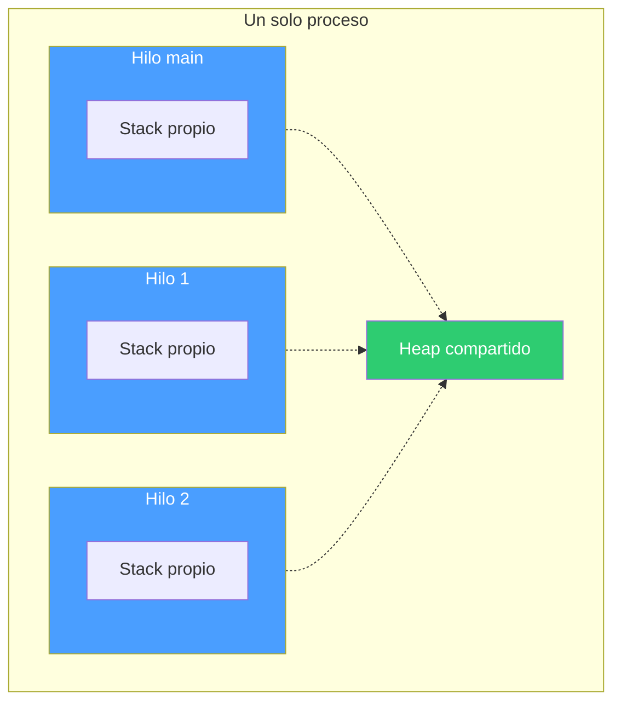
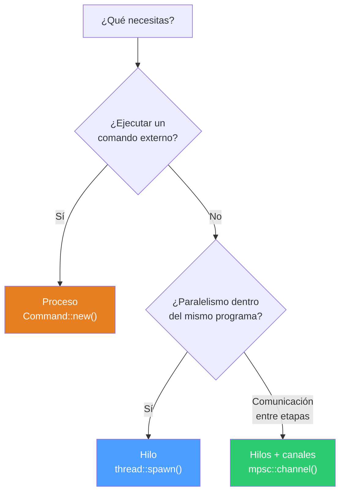

# Parte 3 — Procesos e hilos en Rust

## El concepto

En un sistema operativo, hay dos formas de ejecutar código de forma concurrente:

### Procesos

Un proceso es un programa en ejecución con su propio espacio de memoria, sus propios file descriptors y su propio estado. Cuando lanzas `ls` desde la terminal, el sistema operativo crea un proceso nuevo, completamente aislado del que lo invocó.

Los procesos se comunican entre sí a través de mecanismos del sistema operativo: pipes, archivos, sockets, señales. No comparten memoria directamente.


En C, crearías un proceso con `fork()` + `exec()`. En Rust, usas `Command::new()` que abstrae esa mecánica de forma más segura.

### Hilos (Threads)

Un hilo es un flujo de ejecución dentro del mismo proceso. Todos los hilos comparten el mismo espacio de memoria, pero cada uno tiene su propio stack y su propio punto de ejecución.

Son más ligeros que los procesos (crear un hilo es mucho más barato que crear un proceso) y la comunicación entre ellos es más rápida porque comparten memoria.



El problema clásico de los hilos es que compartir memoria es peligroso: data races, lecturas de datos a medio escribir, corrupción silenciosa. En C, esto se maneja con mutex y disciplina del programador. En Rust, el sistema de ownership previene data races en compilación.

### Procesos vs Hilos

| | Proceso | Hilo |
|---|---|---|
| Memoria | Aislada (cada uno la suya) | Compartida (mismo heap) |
| Comunicación | Pipes, sockets, archivos | Variables compartidas, canales |
| Costo de creación | Alto | Bajo |
| Seguridad | Aislamiento natural | Requiere sincronización |
| Fallo | Un proceso muere sin afectar otros | Un hilo en panic puede afectar al proceso |



---

## Programas

### 01_proceso.rs — Lanzar un comando externo
Ejecuta `ls -l /tmp` como proceso hijo usando `Command::new()` y muestra su código de salida. Es el equivalente Rust de `fork()` + `exec()` en C.

```bash
./01_proceso
```

**Conceptos:** `Command::new`, `.arg()`, `.status()`, `ExitStatus`, propagación de errores con `?`.

---

### 02_proceso_con_pipe.rs — Comunicación entre procesos con pipe
Lanza `wc -c` como proceso hijo, le envía datos por stdin a través de un pipe, y lee el resultado desde stdout. Demuestra IPC (Inter-Process Communication) al estilo Unix.

```bash
./02_proceso_con_pipe
# Salida: salida de wc: 10
```

**Conceptos:** `Stdio::piped()`, `write_all()`, `wait_with_output()`, cierre implícito de stdin por drop.

---

### 03_thread.rs — Crear un hilo
Crea un hilo secundario que corre en paralelo con el hilo principal. Ambos imprimen mensajes intercalados gracias a `thread::sleep`. Demuestra concurrencia básica.

```bash
./03_thread
# Salida intercalada de "main: N" y "hilo: N"
```

**Conceptos:** `thread::spawn`, closures, `JoinHandle`, `join()`, `Duration`, concurrencia.

---

### 04_move.rs — Transferir ownership a un hilo
Muestra por qué `move` es necesario al pasar datos a un hilo. El hilo toma ownership del `String`, y el hilo principal ya no puede usarlo después.

```bash
./04_move
# Salida: hilo dice: hola desde el padre
```

**Conceptos:** `move`, ownership en closures, por qué Rust exige `move` con hilos, prevención de data races en compilación.

---

### 05_move_multihilos.rs — Múltiples hilos con move
Crea 3 hilos en un loop, cada uno captura su variable `i` con `move`. Usa un `Vec<JoinHandle>` para esperar a que todos terminen.

```bash
./05_move_multihilos
# Salida (orden puede variar):
# soy el hilo 0
# soy el hilo 1
# soy el hilo 2
```

**Conceptos:** `Vec<JoinHandle>`, `move` en loop, `join()` secuencial, concurrencia con múltiples hilos.

---

## Documentos complementarios

- **closures.md** — Qué son los closures, cómo capturan variables, `move`, los traits `Fn`/`FnMut`/`FnOnce`.
- **mpsc.md** — Canales de comunicación entre hilos: `Sender`, `Receiver`, múltiples productores, `sync_channel`.

---

## Cómo compilar y ejecutar

```bash
# Compilar
rustc 01_proceso.rs -o bin/01_proceso

# Ejecutar
./bin/01_proceso
```

## Progresión

Los programas siguen una progresión natural:

1. Lanzar un proceso externo (como haría un shell)
2. Conectar procesos con pipes (como `|` en la terminal)
3. Crear hilos dentro del mismo programa
4. Pasar datos a hilos con `move`
5. Manejar múltiples hilos concurrentes

De procesos aislados a hilos que comparten el mismo espacio — con Rust garantizando seguridad en cada paso.
