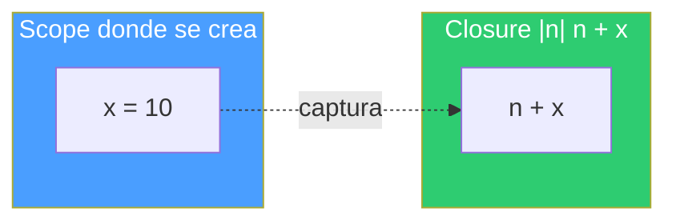
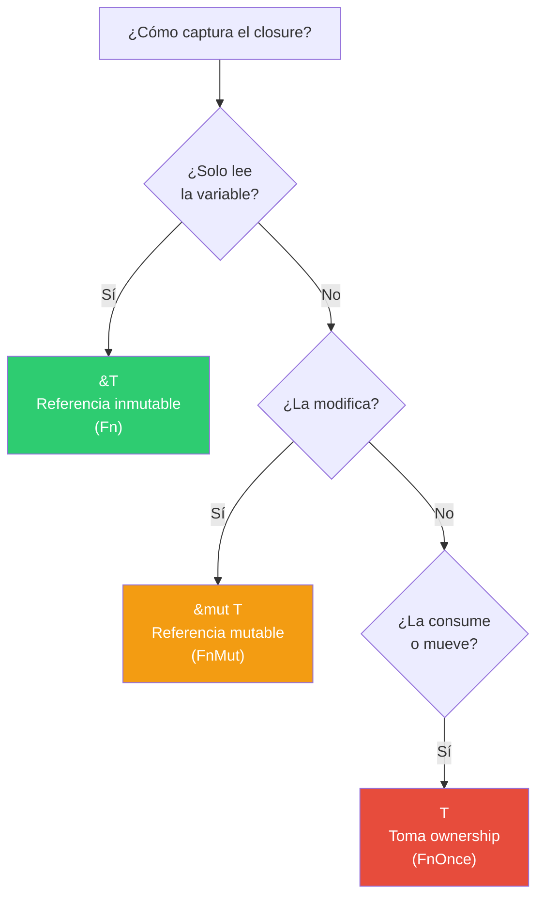
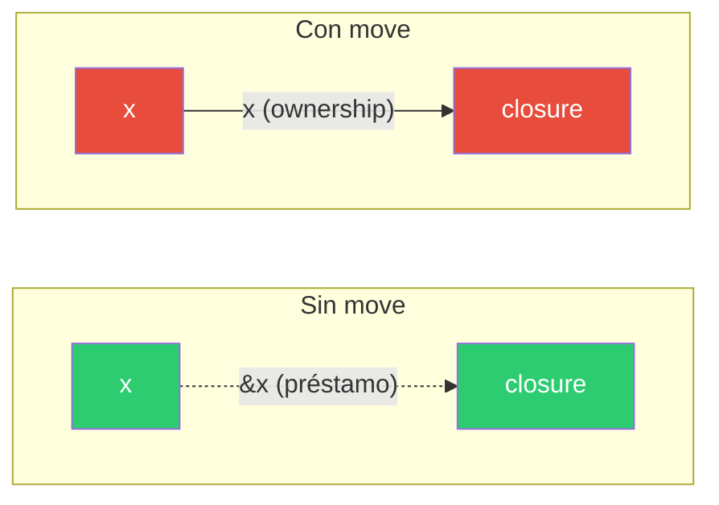
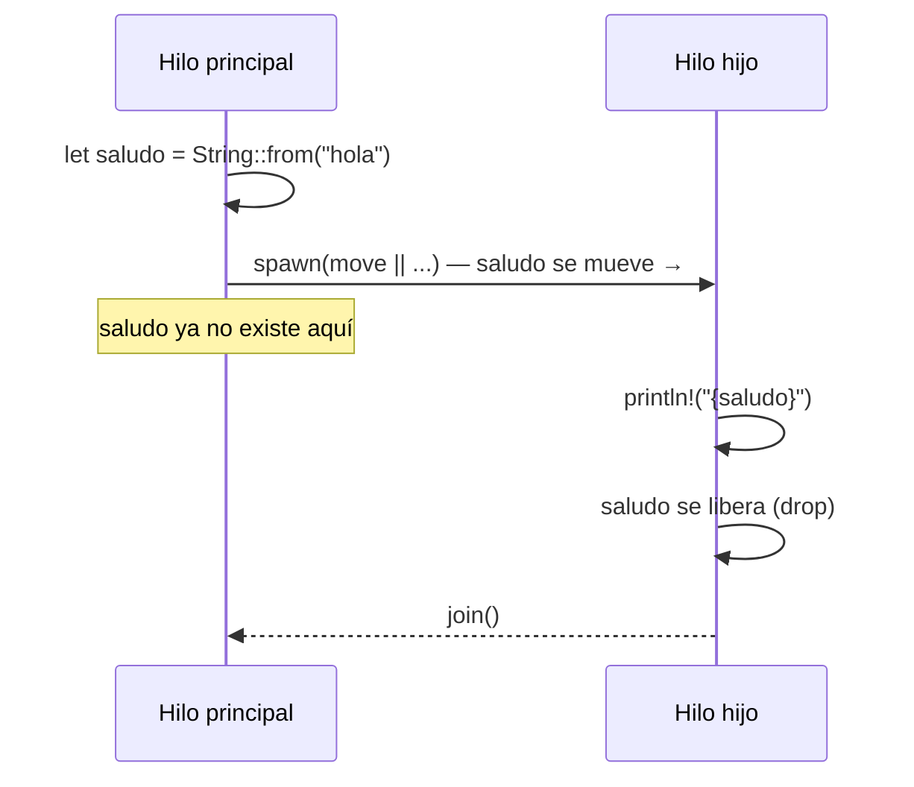

# Closures en Rust

## ¿Qué es un closure?

Un closure es una función anónima que puede **capturar variables de su entorno**. A diferencia de una función normal (`fn`), un closure tiene acceso a las variables del scope donde fue creado.

```rust
let x = 10;
let sumar = |n| n + x;  // captura `x` del entorno
println!("{}", sumar(5)); // 15
```

La sintaxis usa `|parámetros|` en lugar de `(parámetros)`. El cuerpo puede ser una expresión simple o un bloque `{}`.



---

## Sintaxis

```rust
// Sin parámetros
let saludo = || println!("hola");

// Un parámetro (tipo inferido)
let doble = |n| n * 2;

// Múltiples parámetros con tipos explícitos
let sumar = |a: i32, b: i32| -> i32 { a + b };

// Cuerpo con múltiples líneas
let procesar = |texto: &str| {
    let upper = texto.to_uppercase();
    println!("{}", upper);
    upper
};
```

Rust infiere los tipos de los parámetros y el retorno la primera vez que usas el closure. No necesitas anotarlos a menos que quieras ser explícito.

---

## Captura de variables

Lo que hace especial a un closure es que puede usar variables que no le pasaste como parámetro. Rust decide automáticamente **cómo** capturarlas:



### 1. Por referencia inmutable (`&T`) — solo lee

```rust
let nombre = String::from("Rust");
let saludar = || println!("Hola, {}", nombre);
saludar();
println!("{}", nombre); // nombre sigue disponible
```

### 2. Por referencia mutable (`&mut T`) — modifica

```rust
let mut contador = 0;
let mut incrementar = || contador += 1;
incrementar();
incrementar();
println!("{}", contador); // 2
```

### 3. Por valor / move (`T`) — toma ownership

```rust
let nombre = String::from("Rust");
let consumir = move || println!("Hola, {}", nombre);
consumir();
// println!("{}", nombre); // ERROR: nombre fue movido al closure
```

---

## La palabra clave `move`

`move` fuerza al closure a tomar ownership de todo lo que captura, incluso si solo lo lee.

Sin `move`:
```rust
let x = String::from("hola");
let closure = || println!("{}", x); // captura &x (préstamo)
closure();
println!("{}", x); // x sigue disponible
```

Con `move`:
```rust
let x = String::from("hola");
let closure = move || println!("{}", x); // captura x (se lo lleva)
closure();
// println!("{}", x); // ERROR: x fue movido
```



### ¿Cuándo necesitas `move`?

Principalmente con hilos. Un hilo puede vivir más que el scope donde fue creado, así que Rust no permite que tome prestadas variables que podrían dejar de existir:

```rust
use std::thread;

let saludo = String::from("hola desde el padre");

let h = thread::spawn(move || {
    println!("hilo dice: {saludo}");
});

h.join().unwrap();
// saludo ya no existe aquí — el hilo se lo llevó
```

Sin `move`, el compilador rechaza el código porque no puede garantizar que `saludo` viva lo suficiente.



---

## Los tres traits de closures

Rust clasifica los closures con tres traits, según cómo capturan:

| Trait | Captura | Puede llamarse | Ejemplo típico |
|---|---|---|---|
| `Fn` | `&T` (solo lee) | Múltiples veces | Callbacks, iteradores |
| `FnMut` | `&mut T` (modifica) | Múltiples veces | Acumuladores, contadores |
| `FnOnce` | `T` (consume) | Una sola vez | `thread::spawn`, consumir datos |

La jerarquía es: `FnOnce` ⊃ `FnMut` ⊃ `Fn`. Todo closure que implementa `Fn` también implementa `FnMut` y `FnOnce`.

`thread::spawn` requiere `FnOnce` porque el closure se ejecuta una vez en el hilo y luego se destruye.

---

## Closures como parámetros

Puedes escribir funciones que reciban closures:

```rust
fn aplicar<F: Fn(i32) -> i32>(f: F, valor: i32) -> i32 {
    f(valor)
}

let doble = |n| n * 2;
let resultado = aplicar(doble, 5); // 10
```

Esto es lo que hacen los métodos de iteradores como `.map()`, `.filter()`, `.for_each()`:

```rust
let numeros = vec![1, 2, 3, 4, 5];

let pares: Vec<i32> = numeros
    .iter()
    .filter(|n| **n % 2 == 0)  // closure que filtra
    .map(|n| n * 10)            // closure que transforma
    .collect();

// pares = [20, 40]
```

---

## Closures vs funciones

| | Función (`fn`) | Closure |
|---|---|---|
| Captura variables | No | Sí |
| Sintaxis | `fn nombre(params)` | `\|params\|` |
| Tipo | Tiene un tipo concreto | Cada closure tiene un tipo único anónimo |
| Uso típico | Código reutilizable con nombre | Código inline, callbacks, iteradores |

Un closure sin capturas se puede usar donde se espera un puntero a función (`fn`):

```rust
fn aplicar(f: fn(i32) -> i32, x: i32) -> i32 {
    f(x)
}

let resultado = aplicar(|n| n + 1, 5); // funciona porque no captura nada
```

---

## Resumen

- Un closure es una función anónima que captura variables de su entorno.
- Rust decide automáticamente si captura por referencia, referencia mutable, o por valor.
- `move` fuerza la captura por valor (ownership) — necesario para hilos.
- Los tres traits (`Fn`, `FnMut`, `FnOnce`) clasifican closures según cómo capturan.
- Los closures son la base de los iteradores, callbacks, y la concurrencia con `thread::spawn`.
