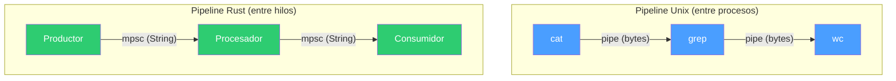
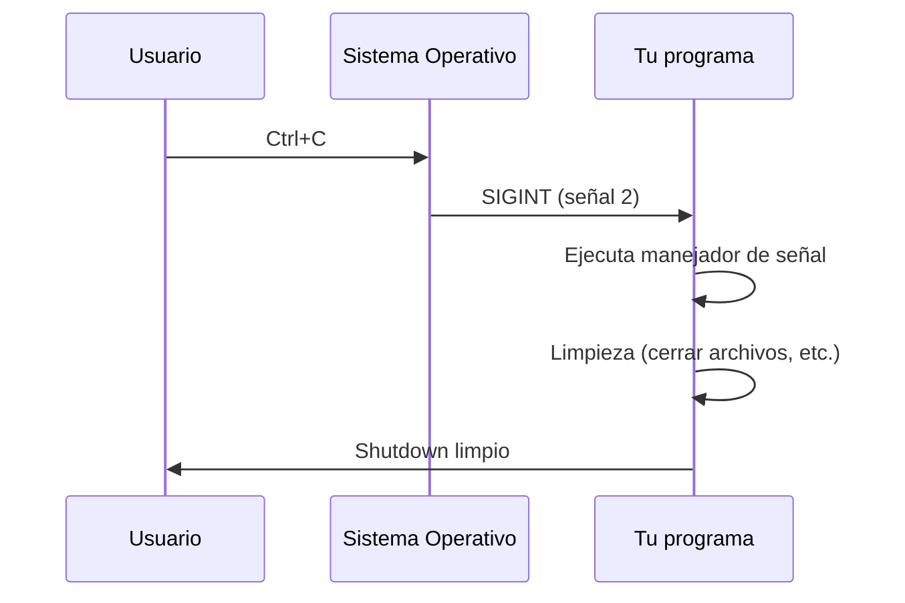
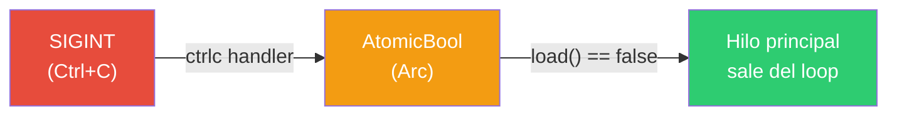

# Parte 4 — Pipes y señales en Rust

## Pipes (tuberías)

Un pipe es un mecanismo del sistema operativo que conecta la salida de un proceso con la entrada de otro. Es la base del operador `|` en la terminal:

```bash
echo hola | wc -c
```

Internamente, el sistema operativo crea un buffer en memoria con dos extremos: uno de escritura y uno de lectura. El primer proceso escribe bytes en un extremo, el segundo los lee del otro.


Características clave:
- Los datos fluyen en una sola dirección (unidireccional)
- El pipe se cierra cuando el escritor termina (EOF)
- Si el lector es más lento, el escritor se bloquea (backpressure natural)
- Los datos son bytes crudos — no tienen estructura

En Rust, `Command` con `Stdio::piped()` crea estos pipes programáticamente, replicando lo que el shell hace con `|`.

### De procesos a hilos

El mismo patrón de pipeline se puede implementar dentro del mismo programa usando hilos y canales `mpsc`. En lugar de bytes crudos entre procesos, pasamos valores tipados entre hilos:



---

## Señales (signals)

Las señales son notificaciones asíncronas que el sistema operativo envía a un proceso. Son el mecanismo más básico de comunicación entre el kernel (o entre procesos) y tu programa.

Las más comunes:

| Señal | Número | Origen | Significado |
|---|---|---|---|
| `SIGINT` | 2 | Ctrl+C en la terminal | "Interrumpe lo que estás haciendo" |
| `SIGTERM` | 15 | `kill <pid>` | "Termina limpiamente" |
| `SIGKILL` | 9 | `kill -9 <pid>` | "Muere ahora" (no se puede capturar) |
| `SIGHUP` | 1 | Terminal se cierra | "Tu terminal desapareció" |



Sin un manejador registrado, `SIGINT` y `SIGTERM` matan el proceso inmediatamente. Registrar un manejador te permite hacer limpieza antes de salir: cerrar conexiones, guardar estado, liberar recursos.

### Dos enfoques en Rust

**Con `ctrlc`** (04_signals.rs) — usa un `AtomicBool` compartido entre el manejador y el hilo principal:



**Con `signal_hook`** (05_signals_hilos.rs) — usa un hilo dedicado que escucha señales y notifica por canal `mpsc`:


---

## Programas

### 01_simple_pipeline.rs — Pipe entre dos procesos
Replica `echo hola | wc -c` conectando dos procesos con `Stdio::piped()`.

```bash
cargo run --bin 01_simple_pipeline
# Salida: 5
```

**Conceptos:** `Command::new`, `Stdio::piped()`, `.stdout.take()`, `.spawn()` vs `.output()`.

---

### 02_tres_pipeline.rs — Pipeline de tres etapas
Replica `cat archivo.txt | grep foo | wc -l` encadenando tres procesos.

```bash
cargo run --bin 02_tres_pipeline
```

**Conceptos:** encadenamiento de pipes, tres procesos conectados, `.take().unwrap()` para transferir ownership del pipe.

---

### 03_pipeline_threads.rs — Pipeline con hilos y mpsc
Mismo patrón de pipeline pero dentro del programa: un hilo produce, otro transforma, el principal consume. Usa canales `mpsc` en lugar de pipes del SO.

```bash
cargo run --bin 03_pipeline_threads
# Salida: UNO DOS TRES
```

**Conceptos:** `mpsc::channel()`, `thread::spawn`, `move`, paso de mensajes entre hilos.

---

### 04_signals.rs — Capturar Ctrl+C con ctrlc
Registra un manejador de SIGINT usando el crate `ctrlc`. Usa un `AtomicBool` compartido con `Arc` para comunicar la señal al hilo principal.

```bash
cargo run --bin 04_signals
# Presiona Ctrl+C → "Recibí SIGINT"
```

**Conceptos:** `ctrlc::set_handler`, `Arc<AtomicBool>`, `Ordering::SeqCst`, polling con `thread::sleep`.

---

### 05_signals_hilos.rs — Señales con hilo dedicado y mpsc
Escucha SIGINT y SIGTERM en un hilo separado usando `signal_hook`. Cuando llega una señal, notifica al hilo principal a través de un canal `mpsc`.

```bash
cargo run --bin 05_signals_hilos
# Presiona Ctrl+C → "Shutdown limpio"
```

**Conceptos:** `signal_hook::iterator::Signals`, hilo dedicado para señales, comunicación por canal, shutdown limpio.

---

## Documentos complementarios

- **mpsc.md** — Canales de comunicación entre hilos (sender, receiver, múltiples productores).
- **cargo.md** — Qué es Cargo, cómo funciona `Cargo.toml`, comandos esenciales.

---

## Cómo compilar y ejecutar

Esta parte usa Cargo porque los programas de señales dependen de crates externos (`ctrlc`, `signal-hook`).

```bash
# Compilar todo
cargo build --release

# Compilar uno específico
cargo build --release --bin 04_signals

# Ejecutar directamente
cargo run --bin 04_signals
```

## Progresión

1. Conectar procesos con pipes (como hace el shell)
2. Encadenar tres procesos en un pipeline
3. Replicar el pipeline con hilos y canales dentro del programa
4. Capturar señales del SO para shutdown limpio
5. Combinar señales, hilos y canales en un patrón robusto
