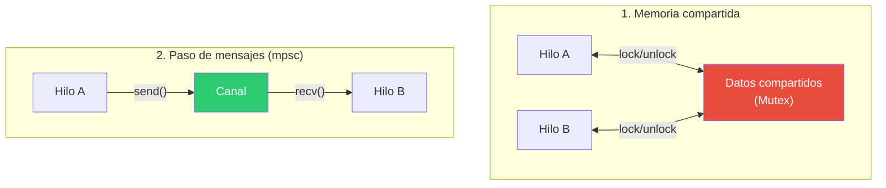
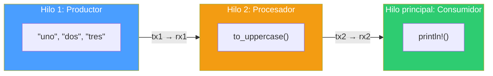
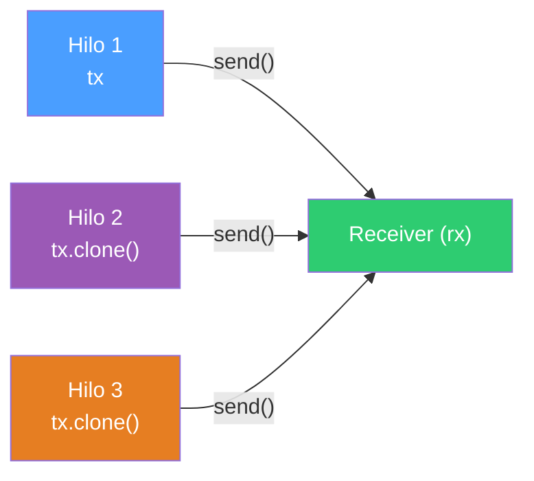

# mpsc — Canales de comunicación entre hilos en Rust

## ¿Qué es mpsc?

`mpsc` significa **Multiple Producer, Single Consumer**. Es el módulo de Rust (`std::sync::mpsc`) que implementa canales para pasar mensajes entre hilos de forma segura.

Un canal tiene dos extremos:

- **Sender** (`tx`) — el lado que envía mensajes. Puede clonarse para tener múltiples productores.
- **Receiver** (`rx`) — el lado que recibe mensajes. Solo puede haber uno.


```rust
use std::sync::mpsc;

let (tx, rx) = mpsc::channel();
```

`tx` y `rx` son los nombres convencionales, por transmitter y receiver.

---

## ¿Por qué existe?

Cuando tienes múltiples hilos, necesitan comunicarse. Hay dos formas clásicas:

1. **Memoria compartida** — varios hilos acceden a los mismos datos, protegidos con mutex o locks.
2. **Paso de mensajes** — los hilos se envían datos a través de canales, sin compartir memoria.



Rust soporta ambas, pero favorece el paso de mensajes. La frase del manual es: *"Do not communicate by sharing memory; instead, share memory by communicating."* (tomada de Go, pero Rust la adopta con su sistema de ownership).

`mpsc` implementa la opción 2. Cada dato enviado por el canal **se mueve** — el hilo que lo envía pierde acceso, el que lo recibe se vuelve dueño. No hay datos compartidos, no hay data races.

---

## Cómo funciona

### Crear un canal

```rust
let (tx, rx) = mpsc::channel();
```

Esto crea un canal sin límite de capacidad (unbounded). Los mensajes se encolan hasta que el receptor los consuma.

### Enviar

```rust
tx.send("hola".to_string()).unwrap();
```

`send()` mueve el valor al canal. Después de enviarlo, el hilo emisor ya no puede usarlo. Retorna `Result` — falla si el receptor ya fue destruido.

### Recibir

```rust
let msg = rx.recv().unwrap();
```

`recv()` bloquea el hilo hasta que llegue un mensaje. Retorna `Result` — falla si todos los transmisores fueron destruidos (el canal está cerrado).

### Iterar

```rust
for msg in rx {
    println!("{}", msg);
}
```

El receptor implementa `Iterator`. El loop se bloquea esperando mensajes y termina automáticamente cuando todos los transmisores se destruyen (el canal se cierra).

---

## Ejemplo: pipeline de 3 etapas

Este es el patrón que usa `03_pipeline_threads.rs` — un pipeline donde cada etapa es un hilo conectado por canales:



```rust
use std::sync::mpsc;
use std::thread;

fn main() {
    let (tx1, rx1) = mpsc::channel();
    let (tx2, rx2) = mpsc::channel();

    // Etapa 1: produce datos
    thread::spawn(move || {
        for s in ["uno", "dos", "tres"] {
            tx1.send(s.to_string()).unwrap();
        }
    });

    // Etapa 2: transforma datos
    thread::spawn(move || {
        for msg in rx1 {
            tx2.send(msg.to_uppercase()).unwrap();
        }
    });

    // Etapa 3: consume datos
    for msg in rx2 {
        println!("{msg}");
    }
}
```

Cada `move` transfiere la propiedad del sender o receiver al hilo. Cuando el hilo termina, el sender se destruye, lo que cierra el canal y hace que el `for` del siguiente hilo termine.

---

## Múltiples productores

La "M" de mpsc. Puedes clonar el sender para que varios hilos envíen al mismo canal:



```rust
let (tx, rx) = mpsc::channel();
let tx2 = tx.clone();

thread::spawn(move || {
    tx.send("desde hilo 1").unwrap();
});

thread::spawn(move || {
    tx2.send("desde hilo 2").unwrap();
});

for msg in rx {
    println!("{}", msg);
}
```

Ambos hilos envían al mismo receptor. El orden de llegada no está garantizado.

---

## Canal con límite: sync_channel

`mpsc::channel()` es unbounded — el productor nunca se bloquea al enviar. Si el productor es más rápido que el consumidor, los mensajes se acumulan en memoria.

`mpsc::sync_channel(n)` crea un canal con buffer de tamaño `n`. Si el buffer está lleno, `send()` bloquea al productor hasta que el consumidor libere espacio:


```rust
let (tx, rx) = mpsc::sync_channel(2); // buffer de 2 mensajes
```

Útil para controlar el ritmo entre productor y consumidor (backpressure).

---

## Analogía con pipes de Unix

`mpsc` es conceptualmente lo mismo que un pipe de Unix (`|`), pero dentro del mismo proceso:


| Pipe Unix | mpsc en Rust |
|---|---|
| `echo hola \| wc -c` | Hilo 1 → canal → Hilo 2 |
| Conecta procesos del SO | Conecta hilos del mismo programa |
| Bytes crudos (`stdout`) | Valores tipados (cualquier tipo `Send`) |
| El SO gestiona el buffer | Rust gestiona el buffer internamente |
| `EOF` cierra el pipe | Destruir el `Sender` cierra el canal |

En `02_tres_pipeline.rs` el pipeline usa procesos reales del SO. En `03_pipeline_threads.rs` el mismo patrón se implementa con hilos y canales `mpsc` — sin salir del programa.

---

## Reglas clave

- El dato se **mueve** al enviarlo. El sender pierde acceso.
- Solo puede haber **un receiver**. Múltiples senders están permitidos (clonar `tx`).
- `recv()` **bloquea** hasta que llegue un mensaje o el canal se cierre.
- Iterar sobre `rx` termina automáticamente cuando todos los senders se destruyen.
- El tipo enviado debe implementar `Send` (casi todos los tipos en Rust lo hacen).
