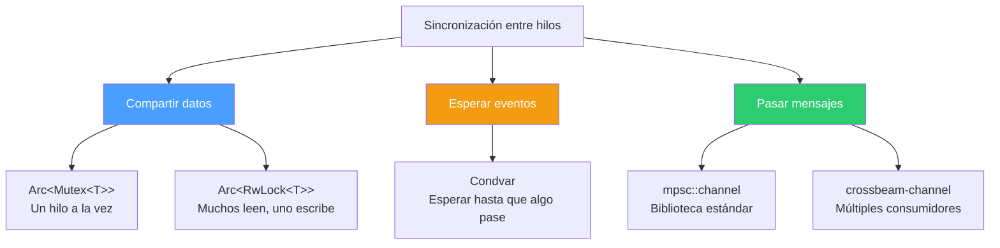
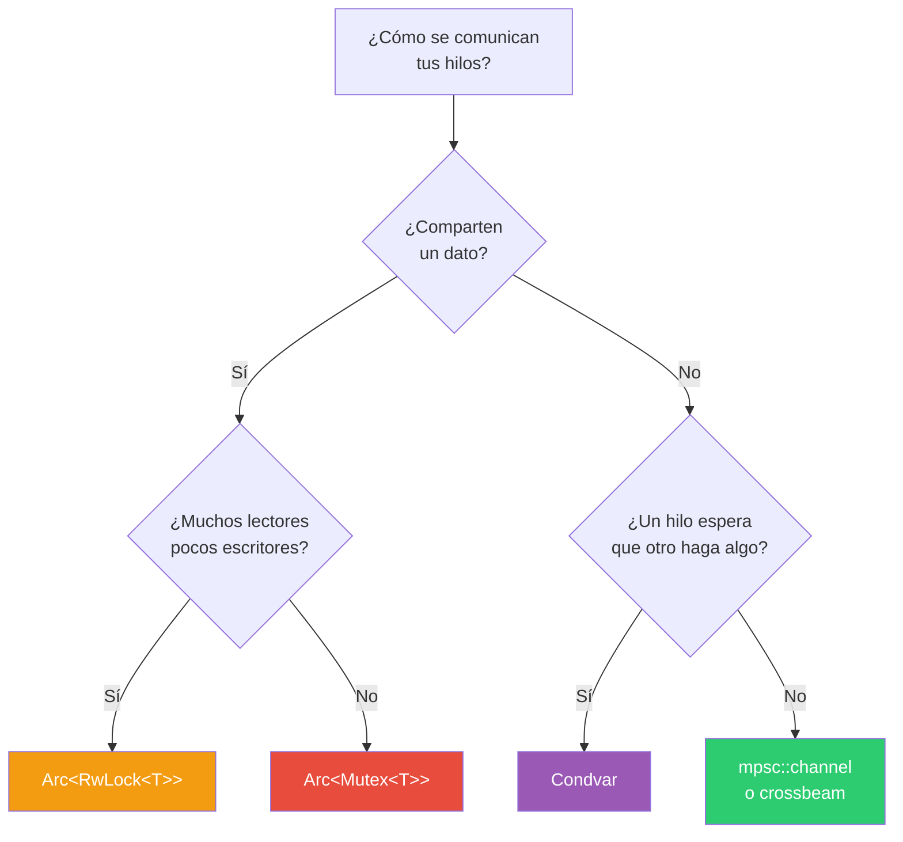

# Parte 5 — Sincronización entre hilos en Rust

## El concepto

Cuando múltiples hilos comparten datos o necesitan coordinarse, se requieren mecanismos de sincronización. Sin ellos, los hilos pueden leer datos a medio escribir, sobrescribirse mutuamente, o quedarse esperando para siempre.

Dentro de un proceso, Rust ofrece tres estrategias:



### Compartir datos: `Arc<Mutex<T>>`, `Arc<RwLock<T>>`

Cuando varios hilos necesitan acceder al mismo dato, lo envuelves en un `Arc` (para compartir ownership entre hilos) y un lock (para controlar el acceso):

- `Mutex<T>` — exclusión mutua. Solo un hilo accede a la vez, ya sea para leer o escribir. Simple y seguro.
- `RwLock<T>` — candado de lectura/escritura. Múltiples lectores simultáneos, pero solo un escritor a la vez. Mejor rendimiento cuando las lecturas son mucho más frecuentes que las escrituras.

### Esperar eventos: `Condvar`

Una variable de condición permite que un hilo se duerma hasta que otro hilo le avise que algo cambió. Evita el polling activo (estar preguntando en un loop "¿ya pasó?").

### Pasar mensajes: `mpsc`, `crossbeam-channel`

En lugar de compartir memoria, los hilos se envían datos a través de canales. El dato se mueve del emisor al receptor — no hay memoria compartida, no hay data races.

- `mpsc::channel` — de la biblioteca estándar. Múltiples productores, un solo consumidor.
- `crossbeam-channel` — crate externo. Soporta múltiples productores y múltiples consumidores, con mejor rendimiento.

---

## ¿Cuándo usar cada uno?



---

## Programas

### 01_mutex.rs — Contador compartido con Mutex
10 hilos incrementan un contador compartido protegido por `Arc<Mutex<i32>>`. Cada hilo adquiere el lock, incrementa, y lo libera automáticamente al salir del scope.

```bash
rustc 01_mutex.rs -o bin/01_mutex
./bin/01_mutex
# Salida: contador = 10
```

**Conceptos:** `Arc::new`, `Arc::clone`, `Mutex::new`, `.lock().unwrap()`, `MutexGuard` y RAII.

---

### 02_rw_lock.rs — Lectores y escritor con RwLock
Dos hilos lectores y un hilo escritor acceden al mismo dato. Los lectores usan `.read()` (pueden ser simultáneos), el escritor usa `.write()` (acceso exclusivo).

```bash
rustc 02_rw_lock.rs -o bin/02_rw_lock
./bin/02_rw_lock
```

**Conceptos:** `Arc<RwLock<T>>`, `.read()` vs `.write()`, acceso concurrente de lectura, orden no determinista.

---

### 03_condvar.rs — Esperar un evento con Condvar
Un hilo productor espera 500ms y luego señaliza un evento. Un hilo consumidor se duerme con `cvar.wait()` hasta que el productor lo despierte con `cvar.notify_one()`.

```bash
rustc 03_condvar.rs -o bin/03_condvar
./bin/03_condvar
# Salida (después de ~500ms): Evento recibido
```

**Conceptos:** `Arc<(Mutex<bool>, Condvar)>`, `wait()` con guard, `notify_one()`, evitar polling activo.

---

### 04_channels.rs — Paso de mensajes con mpsc
Un hilo hijo envía un mensaje al hilo principal a través de un canal `mpsc`. El hilo principal se bloquea en `recv()` hasta que llega el mensaje.

```bash
rustc 04_channels.rs -o bin/04_channels
./bin/04_channels
# Salida: recibido: hola desde thread hijo
```

**Conceptos:** `mpsc::channel()`, `tx.send()`, `rx.recv()`, `move` para transferir el sender al hilo.

---

## Documentos complementarios

- **arc.md** — Qué es `Arc`, cómo funciona el conteo de referencias atómico, diferencia con `Rc`.
- **ipc_unix.md** — Mecanismos de comunicación entre procesos en Unix (pipes, señales, sockets, memoria compartida).

---

## Cómo compilar y ejecutar

Estos programas solo usan la biblioteca estándar, así que se pueden compilar con `rustc` directamente:

```bash
rustc 01_mutex.rs -o bin/01_mutex
./bin/01_mutex
```

## Progresión

1. `Mutex` — el candado más básico, un hilo a la vez
2. `RwLock` — optimización para muchos lectores
3. `Condvar` — esperar eventos sin polling
4. `mpsc` — comunicación sin memoria compartida

De lo más restrictivo (un hilo a la vez) a lo más desacoplado (mensajes sin estado compartido).
