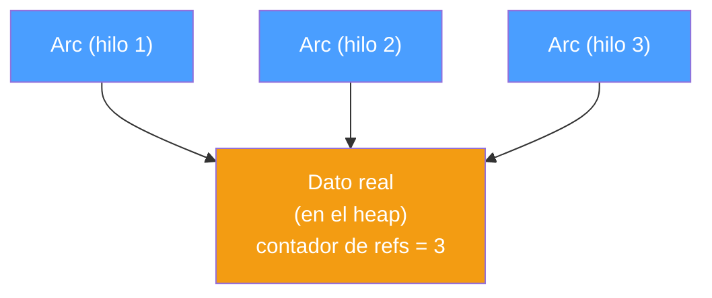
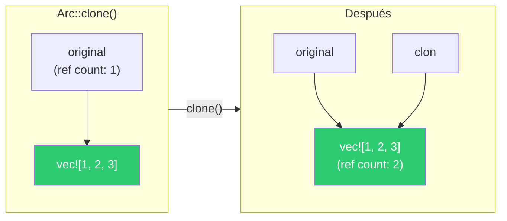
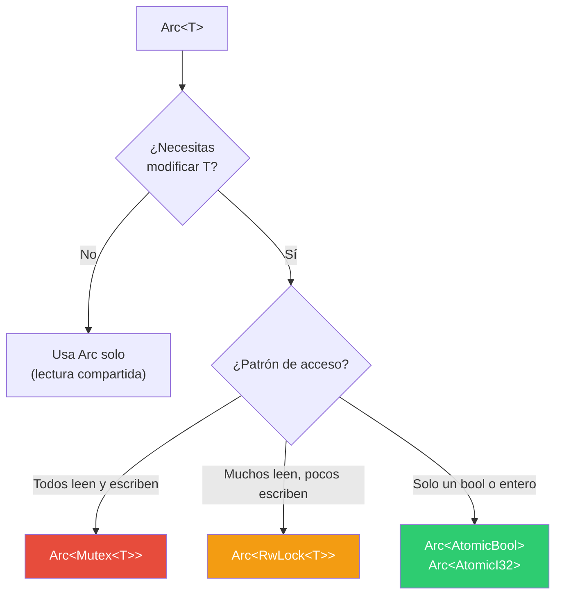
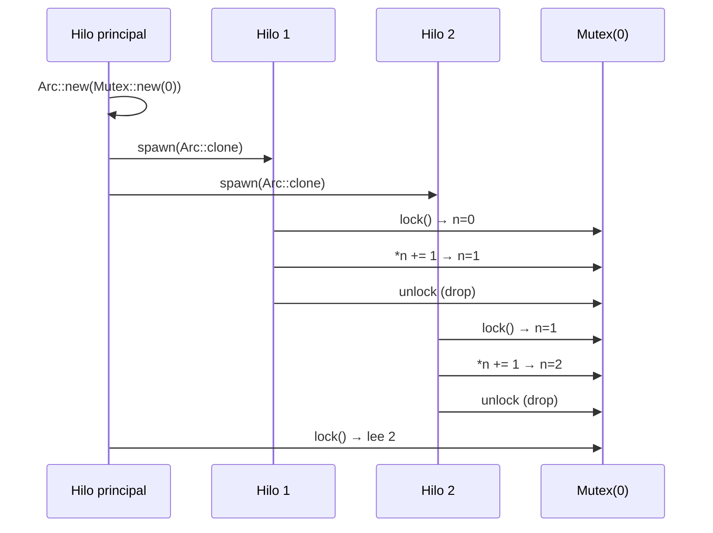
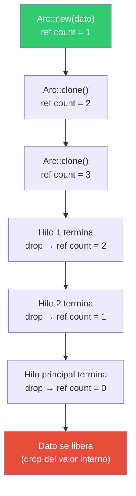

# Arc — Compartir datos entre hilos en Rust

## El problema

En Rust, cada valor tiene un solo dueño. Cuando creas un hilo con `thread::spawn`, el closure necesita ser dueño de los datos que usa (por eso usamos `move`). Pero ¿qué pasa si dos o más hilos necesitan acceder al mismo dato?

```rust
let contador = Mutex::new(0);

// ERROR: no puedes mover `contador` a dos hilos
thread::spawn(move || { /* usa contador */ });
thread::spawn(move || { /* usa contador */ }); // ya fue movido arriba
```

No puedes mover el mismo valor a dos hilos. Necesitas una forma de tener múltiples dueños.

---

## ¿Qué es Arc?

`Arc` significa **Atomic Reference Counted**. Es un puntero inteligente que permite que múltiples partes del código sean dueñas del mismo dato, de forma segura entre hilos.

```rust
use std::sync::Arc;

let dato = Arc::new(42);
let copia = Arc::clone(&dato); // no copia el 42, solo incrementa el contador
```



Internamente, `Arc` mantiene un contador atómico de cuántas referencias existen. Cada `Arc::clone()` incrementa el contador. Cuando un `Arc` se destruye (sale de scope), el contador decrementa. Cuando llega a cero, el dato se libera.

"Atómico" significa que el contador se actualiza de forma segura entre hilos, sin necesidad de un lock.

---

## Arc::clone no copia el dato

Esto es importante: `Arc::clone(&dato)` no duplica el dato interno. Solo crea otro puntero al mismo dato e incrementa el contador de referencias. Es una operación barata.

```rust
let original = Arc::new(vec![1, 2, 3]); // el vector vive en el heap
let clon = Arc::clone(&original);       // otro puntero al MISMO vector

// original y clon apuntan a la misma memoria
```



---

## Arc solo da acceso de lectura

`Arc` por sí solo solo permite leer el dato. No puedes modificarlo. Para modificar, necesitas combinarlo con un mecanismo de sincronización:

| Combinación | Uso |
|---|---|
| `Arc<Mutex<T>>` | Un hilo a la vez lee o escribe |
| `Arc<RwLock<T>>` | Muchos leen, uno escribe |
| `Arc<AtomicBool>` | Booleano compartido sin lock |
| `Arc<(Mutex<T>, Condvar)>` | Esperar una condición entre hilos |



---

## Ejemplo: contador compartido con Arc + Mutex

Del archivo `01_mutex.rs`:

```rust
use std::sync::{Arc, Mutex};
use std::thread;

fn main() {
    let contador = Arc::new(Mutex::new(0));
    let mut handles = vec![];

    for _ in 0..10 {
        let contador = Arc::clone(&contador); // clonar Arc, no el dato
        let h = thread::spawn(move || {
            let mut n = contador.lock().unwrap();
            *n += 1;
        });
        handles.push(h);
    }

    for h in handles {
        h.join().unwrap();
    }

    println!("contador = {}", *contador.lock().unwrap()); // 10
}
```



El flujo:
1. `Arc::new(Mutex::new(0))` crea el dato en el heap con ref count = 1
2. Cada `Arc::clone()` incrementa el ref count (no copia el dato)
3. `move` transfiere el Arc clonado al hilo
4. Dentro del hilo, `lock()` adquiere el mutex
5. Al salir del scope, el `MutexGuard` se destruye y libera el lock
6. Cuando el hilo termina, su Arc se destruye y el ref count decrementa
7. Al final, solo queda el Arc del hilo principal (ref count = 1)

---

## Arc vs Rc

Rust tiene dos punteros con conteo de referencias:

| | `Rc<T>` | `Arc<T>` |
|---|---|---|
| Módulo | `std::rc::Rc` | `std::sync::Arc` |
| Seguro entre hilos | No | Sí |
| Contador | Normal (no atómico) | Atómico |
| Costo | Más barato | Ligeramente más caro |
| Cuándo usarlo | Un solo hilo | Múltiples hilos |

`Rc` es más rápido porque no necesita operaciones atómicas, pero el compilador te impide usarlo entre hilos. Si intentas pasar un `Rc` a `thread::spawn`, obtienes un error de compilación.

---

## Ciclo de vida del ref count



No hay garbage collector. No hay `free()` manual. El dato se libera exactamente cuando el último Arc desaparece.

---

## Resumen

- `Arc` permite múltiples dueños del mismo dato entre hilos.
- `Arc::clone()` es barato — solo incrementa un contador, no copia el dato.
- `Arc` solo da lectura. Para escribir, combínalo con `Mutex`, `RwLock`, o tipos atómicos.
- El dato se libera automáticamente cuando el último `Arc` se destruye.
- Usa `Rc` si estás en un solo hilo, `Arc` si necesitas cruzar hilos.
