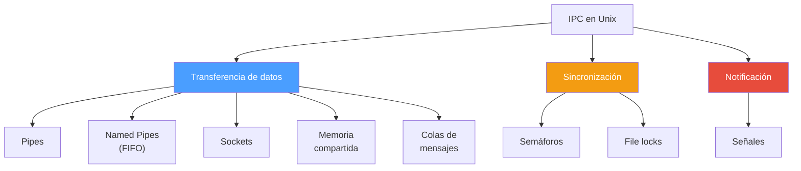
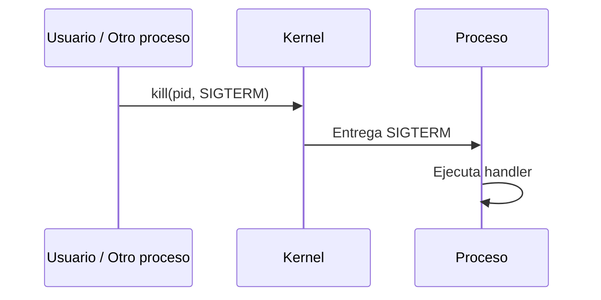
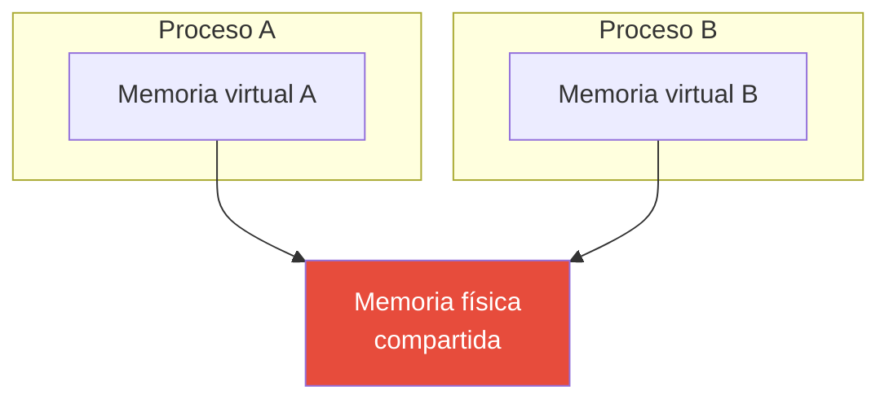
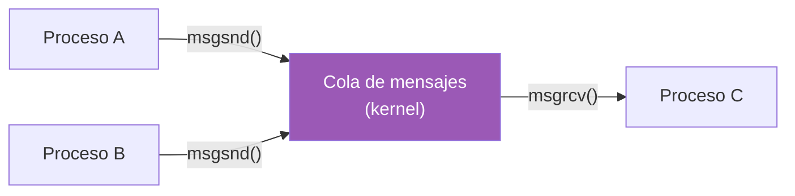
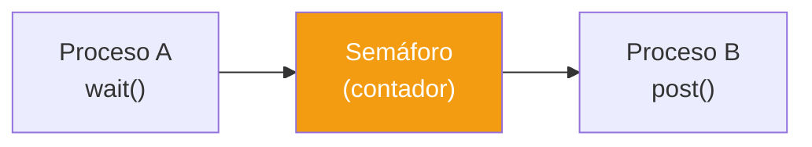
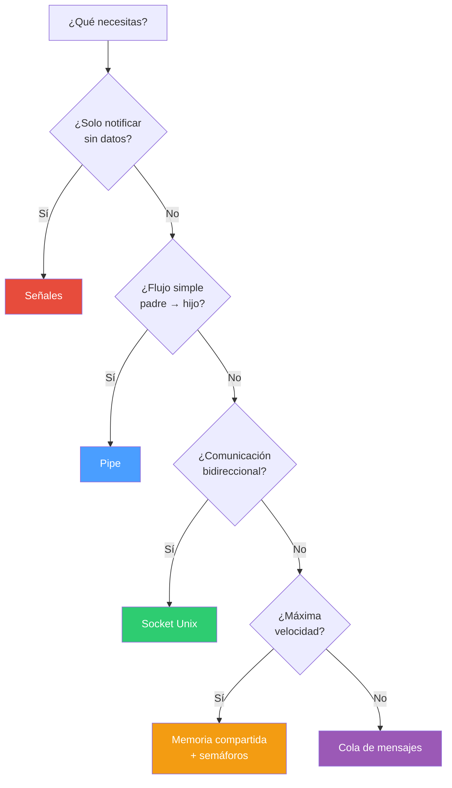

# Comunicación entre procesos en Unix (IPC)

## El problema

En Unix, cada proceso tiene su propio espacio de memoria aislado. Un proceso no puede leer ni escribir la memoria de otro directamente. Esto es bueno para seguridad y estabilidad — si un proceso se muere, no corrompe a los demás.

Pero los procesos necesitan comunicarse. Un servidor web necesita hablar con la base de datos. Un shell necesita conectar la salida de `grep` con la entrada de `wc`. Un daemon necesita saber que le mandaron una señal de shutdown.

Unix ofrece varios mecanismos de IPC (Inter-Process Communication), cada uno con diferentes características.

---

## Los mecanismos



---

## 1. Pipes (tuberías)

El mecanismo más simple. Un pipe es un buffer en el kernel con dos extremos: uno de escritura y uno de lectura. Los datos fluyen en una sola dirección.


Características:
- Unidireccional (un extremo escribe, el otro lee)
- Solo funciona entre procesos relacionados (padre-hijo)
- Los datos son un flujo de bytes sin estructura
- Se cierra automáticamente cuando el escritor termina (EOF)
- Capacidad limitada (~64KB en Linux) — si se llena, el escritor se bloquea

En la terminal:
```bash
cat archivo.txt | grep error | wc -l
```

En Rust:
```rust
use std::process::{Command, Stdio};

let mut cat = Command::new("cat")
    .arg("archivo.txt")
    .stdout(Stdio::piped())
    .spawn()?;

let output = Command::new("grep")
    .arg("error")
    .stdin(cat.stdout.take().unwrap())
    .output()?;
```

---

## 2. Named Pipes (FIFO)

Como un pipe, pero con nombre en el sistema de archivos. Cualquier proceso puede abrirlo, no solo procesos relacionados.

```bash
# Crear el FIFO
mkfifo /tmp/mi_canal

# Terminal 1: escribir
echo "hola" > /tmp/mi_canal

# Terminal 2: leer
cat /tmp/mi_canal
```


Características:
- Persiste en el sistema de archivos (tiene una ruta)
- Cualquier proceso puede abrirlo (no necesitan ser padre-hijo)
- Sigue siendo unidireccional
- Se bloquea hasta que ambos extremos estén abiertos

---

## 3. Señales

Notificaciones asíncronas del kernel a un proceso. No llevan datos (solo un número de señal). Son el mecanismo más primitivo.



| Señal | Número | Significado |
|---|---|---|
| SIGINT | 2 | Ctrl+C — interrumpir |
| SIGTERM | 15 | Terminar limpiamente |
| SIGKILL | 9 | Matar (no se puede capturar) |
| SIGHUP | 1 | Terminal cerrada |
| SIGPIPE | 13 | Escribir a pipe sin lector |
| SIGUSR1/2 | 10/12 | Definidas por el usuario |

Limitaciones:
- No llevan datos (solo el número de señal)
- Pueden perderse si llegan varias del mismo tipo seguidas
- El handler se ejecuta en un contexto restringido (no puedes hacer mucho dentro)

---

## 4. Sockets Unix (Unix Domain Sockets)

Como sockets de red, pero locales. Bidireccionales, con soporte para streams y datagramas. El mecanismo más versátil para IPC local.


Características:
- Bidireccional
- Soporta streams (como TCP) y datagramas (como UDP)
- Más rápido que sockets TCP/IP (no pasa por la pila de red)
- Tiene una ruta en el sistema de archivos
- Soporta pasar file descriptors entre procesos

Muchos servicios los usan: Docker (`/var/run/docker.sock`), PostgreSQL, systemd.

---

## 5. Memoria compartida

Dos o más procesos mapean la misma región de memoria física. Es el mecanismo más rápido porque no hay copia de datos — ambos procesos leen y escriben directamente en la misma memoria.



Características:
- El más rápido (cero copias)
- Requiere sincronización manual (semáforos o mutex)
- Peligroso si no se sincroniza correctamente
- Se crea con `shmget`/`shmat` (System V) o `shm_open`/`mmap` (POSIX)

---

## 6. Colas de mensajes

El kernel mantiene una cola donde los procesos depositan y retiran mensajes con estructura (tipo + datos).



Características:
- Los mensajes tienen tipo y cuerpo
- Múltiples escritores y lectores
- Persisten hasta que se eliminan explícitamente
- Dos APIs: System V (`msgget`/`msgsnd`) y POSIX (`mq_open`/`mq_send`)

---

## 7. Semáforos

No transfieren datos — solo sincronizan. Un semáforo es un contador que los procesos incrementan y decrementan para coordinar acceso a recursos compartidos.



---

## Comparación

| Mecanismo | Dirección | Datos | Velocidad | Complejidad | Procesos relacionados |
|---|---|---|---|---|---|
| Pipe | Unidireccional | Stream de bytes | Rápido | Baja | Sí (padre-hijo) |
| Named Pipe | Unidireccional | Stream de bytes | Rápido | Baja | No |
| Señales | Unidireccional | Solo número | Muy rápido | Baja | No |
| Socket Unix | Bidireccional | Stream o datagramas | Rápido | Media | No |
| Memoria compartida | Bidireccional | Cualquier cosa | Más rápido | Alta | No |
| Cola de mensajes | Bidireccional | Mensajes tipados | Medio | Media | No |
| Semáforos | N/A (sincronización) | Ninguno | Rápido | Media | No |

---

## ¿Cuál usar?



---

## IPC en Rust

Rust no reinventa estos mecanismos — los usa a través de la biblioteca estándar y crates:

| Mecanismo Unix | En Rust |
|---|---|
| Pipe | `Command` + `Stdio::piped()` |
| Señales | Crates `ctrlc`, `signal-hook` |
| Sockets Unix | `std::os::unix::net::UnixStream` |
| Memoria compartida | Crate `shared_memory` |
| Semáforos | Crate `posix-semaphore` |

Dentro del mismo proceso, Rust ofrece alternativas propias que son más seguras:
- `mpsc::channel()` en lugar de pipes entre hilos
- `Arc<Mutex<T>>` en lugar de memoria compartida con semáforos
- `Condvar` en lugar de señales entre hilos

La ventaja de las primitivas de Rust es que el compilador verifica la seguridad en tiempo de compilación. Con IPC de Unix, la responsabilidad es del programador.
