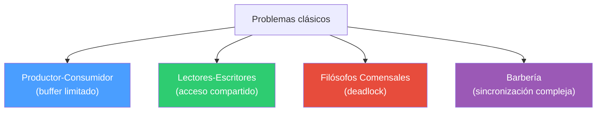
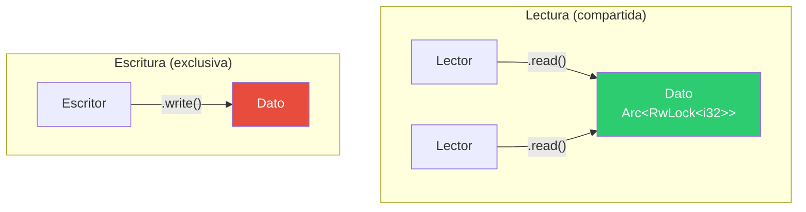
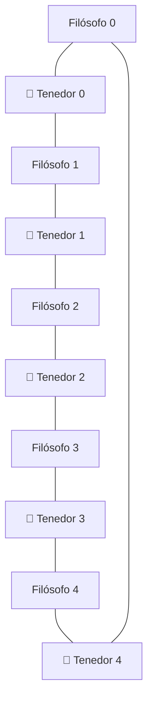
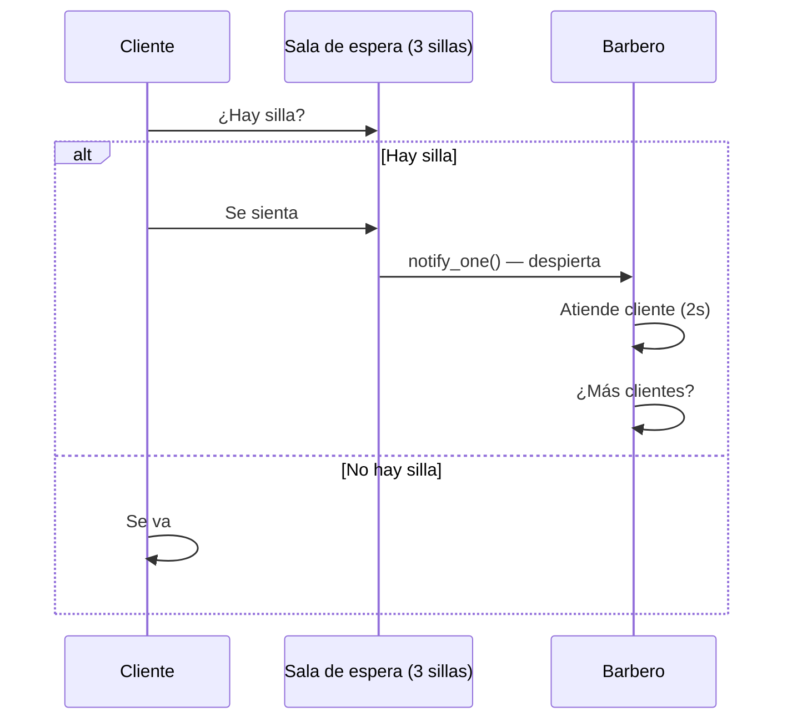

# Parte 6 — Problemas clásicos de concurrencia en Rust

## El concepto

Estos son los cuatro problemas clásicos que aparecen en cualquier curso de sistemas operativos. Cada uno ilustra un patrón diferente de sincronización entre hilos y los bugs que pueden surgir si no se manejan correctamente: condiciones de carrera, deadlock, starvation.

Rust no elimina estos problemas por arte de magia — pero su sistema de tipos hace que muchos errores comunes sean imposibles de compilar.



---

## 01_productor_consumidor.rs — Productor-Consumidor

### El problema

Un productor genera datos, un consumidor los procesa, y hay un buffer en medio. Los riesgos clásicos:
- El productor escribe cuando el buffer está lleno
- El consumidor lee cuando el buffer está vacío
- Condiciones de carrera si ambos acceden al buffer al mismo tiempo


### La solución en Rust

```rust
use std::sync::mpsc;
use std::thread;

fn main() {
    let (tx, rx) = mpsc::channel();

    thread::spawn(move || {
        for i in 0..5 {
            tx.send(i).unwrap();
        }
    });

    for recibido in rx {
        println!("Consumido: {}", recibido);
    }
}
```

`mpsc::channel()` resuelve el problema de forma elegante:
- El canal actúa como buffer entre productor y consumidor
- `send()` nunca falla por buffer lleno (el canal es unbounded)
- `for recibido in rx` se bloquea automáticamente cuando no hay datos
- Cuando el productor termina y `tx` se destruye, el loop del consumidor termina
- No hay condiciones de carrera — el dato se **mueve** por el canal

En C, este problema requiere un buffer compartido protegido con mutex y dos semáforos (uno para "hay espacio" y otro para "hay datos"). En Rust, el canal lo resuelve en 10 líneas.

---

## 02_lectores_escritores.rs — Lectores-Escritores

### El problema

Muchos hilos necesitan leer un dato compartido, pero ocasionalmente uno necesita escribir. Las reglas:
- Múltiples lectores pueden leer al mismo tiempo
- Solo un escritor puede escribir a la vez
- Nadie puede leer mientras se escribe

Los riesgos: starvation (un lado nunca accede porque el otro siempre tiene prioridad).



### La solución en Rust

```rust
use std::sync::{Arc, RwLock};
use std::thread;

fn main() {
    let data = Arc::new(RwLock::new(5));

    let r = {
        let data = Arc::clone(&data);
        thread::spawn(move || {
            let val = data.read().unwrap();
            println!("lector: {}", *val);
        })
    };

    let w = {
        let data = Arc::clone(&data);
        thread::spawn(move || {
            let mut val = data.write().unwrap();
            *val += 1;
        })
    };

    r.join().unwrap();
    w.join().unwrap();
}
```

- `Arc::clone(&data)` — cada hilo obtiene su propia referencia al dato compartido
- `data.read().unwrap()` — adquiere un lock de lectura (múltiples lectores simultáneos)
- `data.write().unwrap()` — adquiere un lock de escritura (exclusivo, bloquea a todos)
- Los guards (`val`) se liberan automáticamente al salir del scope (RAII)

El orden de ejecución no es determinista: el lector puede ver `5` (si lee antes del escritor) o `6` (si lee después).

---

## 03_filosofos_comensales.rs — Filósofos Comensales

### El problema

5 filósofos sentados en una mesa circular. Entre cada par hay un tenedor. Para comer, cada filósofo necesita los dos tenedores adyacentes. Los riesgos:
- **Deadlock**: todos toman el tenedor izquierdo al mismo tiempo y se quedan esperando el derecho para siempre
- **Starvation**: un filósofo nunca consigue ambos tenedores



### La solución en Rust

```rust
use std::sync::{Arc, Mutex};
use std::thread;

fn main() {
    let forks: Vec<_> = (0..5).map(|_| Arc::new(Mutex::new(()))).collect();

    let handles: Vec<_> = (0..5).map(|i| {
        let left = Arc::clone(&forks[i]);
        let right = Arc::clone(&forks[(i + 1) % 5]);

        thread::spawn(move || {
            let _l = left.lock().unwrap();
            let _r = right.lock().unwrap();
            println!("Filósofo {} comiendo", i);
        })
    }).collect();

    for h in handles {
        h.join().unwrap();
    }
}
```

Cada tenedor es un `Mutex<()>` — el valor no importa, solo el lock. Cada filósofo:
1. Toma el tenedor izquierdo (`left.lock()`)
2. Toma el tenedor derecho (`right.lock()`)
3. Come
4. Suelta ambos al salir del scope (RAII)

**Advertencia**: esta implementación puede hacer deadlock. Si los 5 filósofos toman su tenedor izquierdo al mismo tiempo, todos se quedan esperando el derecho. Soluciones clásicas:
- Que un filósofo tome los tenedores en orden inverso
- Usar un semáforo que limite a 4 filósofos intentando comer a la vez
- Usar `try_lock()` y soltar si no se consigue el segundo

---

## 04_barberia.rs — El Barbero Dormilón

### El problema

Una barbería con un barbero y una sala de espera con sillas limitadas:
- Si no hay clientes, el barbero duerme
- Si llega un cliente y hay silla, se sienta y despierta al barbero
- Si no hay silla, el cliente se va
- El barbero atiende uno por uno



### La solución en Rust

Este es el ejemplo más complejo. Usa `Arc<(Mutex<EstadoBarberia>, Condvar)>` para coordinar todo:

```rust
struct EstadoBarberia {
    sala_espera: VecDeque<Cliente>,  // cola FIFO de clientes
    capacidad: usize,                // número de sillas
    abierta: bool,                   // si la barbería sigue abierta
}
```

**El barbero** (función `barbero`):
- Adquiere el lock del estado
- Si no hay clientes y la barbería está abierta, se duerme con `cvar.wait()`
- Cuando lo despiertan, toma al siguiente cliente de la cola (`pop_front`)
- Lo atiende durante 2 segundos (simulado con `sleep`)
- Si la barbería cerró y no quedan clientes, termina

**Cada cliente** (función `cliente`):
- Adquiere el lock del estado
- Si hay silla disponible (`sala_espera.len() < capacidad`), se agrega a la cola y despierta al barbero con `cvar.notify_one()`
- Si no hay silla, se va

**El hilo principal**:
- Lanza el hilo del barbero
- Lanza 10 clientes que llegan escalonados (cada 300ms)
- Espera a que todos lleguen
- Cierra la barbería cambiando `abierta = false` y notificando al barbero

La `Condvar` es clave: evita que el barbero haga polling ("¿hay clientes? ¿hay clientes? ¿hay clientes?"). En su lugar, se duerme y solo despierta cuando un cliente lo notifica.

---

## Resumen de primitivas usadas

| Problema | Primitiva | Por qué |
|---|---|---|
| Productor-Consumidor | `mpsc::channel` | Paso de mensajes, sin estado compartido |
| Lectores-Escritores | `Arc<RwLock<T>>` | Lecturas concurrentes, escritura exclusiva |
| Filósofos | `Arc<Mutex<()>>` | Exclusión mutua sobre recursos (tenedores) |
| Barbería | `Arc<(Mutex<T>, Condvar)>` | Estado compartido + espera de eventos |

---

## Cómo compilar y ejecutar

```bash
rustc 01_productor_consumidor.rs -o bin/01_productor_consumidor
./bin/01_productor_consumidor

rustc 04_barberia.rs -o bin/04_barberia
./bin/04_barberia
```
