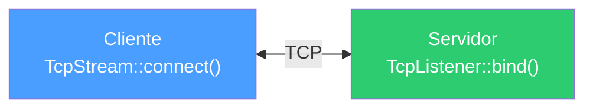
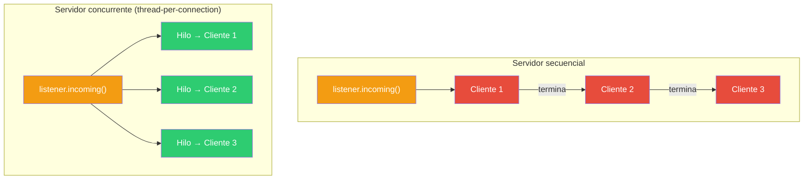
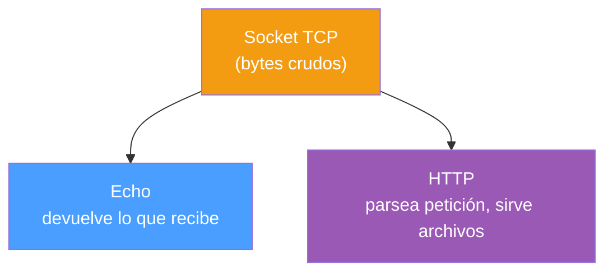
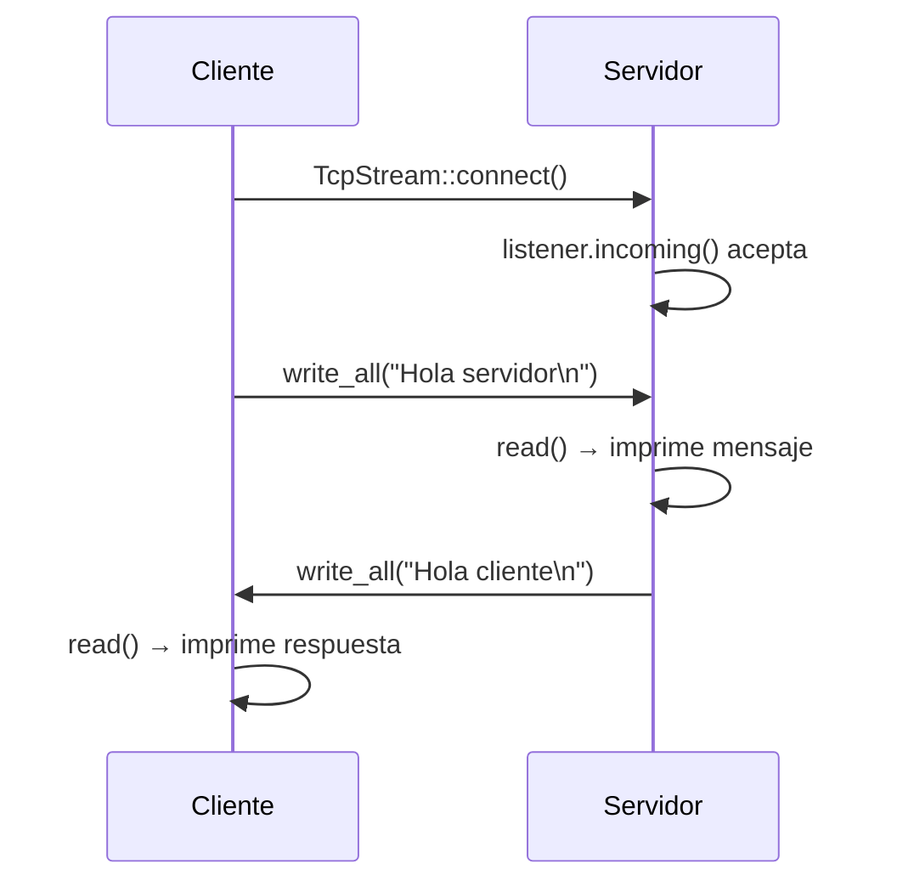
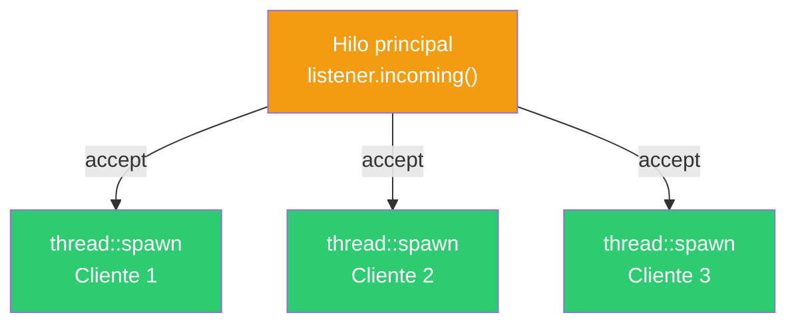
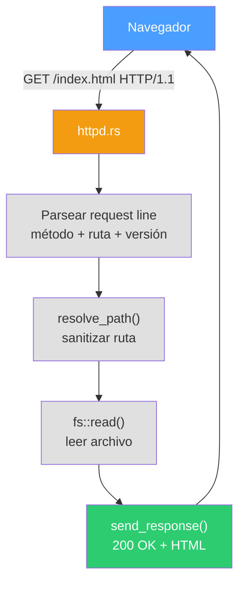

# Parte 7 — Programación de red (sockets TCP) en Rust

## El concepto

Los sockets TCP son la base de casi toda la comunicación en red: HTTP, bases de datos, chat, transferencia de archivos. Un socket es un extremo de una conexión de red, identificado por una dirección IP y un puerto.

El flujo clásico en C es:
- **Cliente:** `socket()` → `connect()` → `write()` → `read()` → `close()`
- **Servidor:** `socket()` → `bind()` → `listen()` → `accept()` → `read()` → `write()` → `close()`

En Rust, `TcpStream` y `TcpListener` encapsulan todo esto. Los sockets implementan los traits `Read` y `Write`, así que se usan igual que un archivo. Y se cierran automáticamente al salir de scope (RAII).



### Del servidor secuencial al concurrente

Un servidor secuencial atiende un cliente a la vez — mientras procesa uno, los demás esperan. Un servidor concurrente lanza un hilo por conexión, atendiendo múltiples clientes en paralelo:



### Del echo al HTTP

El servidor echo es el "Hello World" de la red: devuelve todo lo que recibe. El servidor HTTP agrega un protocolo sobre TCP: parsea la línea de petición, las cabeceras, y responde con un formato estructurado (status line + headers + body).



---

## Programas

### 01_cliente.rs — Cliente TCP básico

Se conecta a un servidor en `127.0.0.1:7878`, envía `"Hola servidor\n"`, lee la respuesta y la imprime. Es la contraparte de `02_servidor.rs`.

```bash
rustc 01_cliente.rs -o bin/01_cliente
./bin/01_cliente
# Salida: Respuesta: Hola cliente
```

**Conceptos:** `TcpStream::connect()`, `write_all()` vs `write()`, `read()` con buffer fijo, `String::from_utf8_lossy()`, RAII (el stream se cierra al salir de scope).

---

### 02_servidor.rs — Servidor TCP secuencial

Escucha en `127.0.0.1:7878` y atiende clientes uno por uno. Lee lo que el cliente envía, lo imprime, y responde con `"Hola cliente\n"`. Mientras atiende a un cliente, los demás esperan en la cola del SO.

```bash
rustc 02_servidor.rs -o bin/02_servidor
./bin/02_servidor
# En otra terminal: ./bin/01_cliente
```



**Conceptos:** `TcpListener::bind()`, `listener.incoming()` (iterador infinito), `match` para manejar errores sin detener el servidor, función `manejar_cliente()` separada.

---

### 03_servidor_multihilo.rs — Servidor TCP concurrente

Evolución del servidor secuencial: cada conexión se atiende en un hilo separado con `thread::spawn`. El hilo principal queda libre para aceptar nuevas conexiones inmediatamente.

```bash
rustc 03_servidor_multihilo.rs -o bin/03_servidor_multihilo
./bin/03_servidor_multihilo
# Conectar varios clientes simultáneamente
```



**Conceptos:** `thread::spawn(move || ...)`, `move` para transferir ownership del stream al hilo, `thread::current().id()` para identificar hilos, patrón thread-per-connection.

⚠️ Crear un hilo por conexión no escala con miles de clientes. Para eso se usan thread pools o async (tokio).

---

### 04_net_echo.rs — Servidor Echo

El servidor echo devuelve todo lo que el cliente envía, byte por byte. Escucha en `127.0.0.1:9000` y atiende cada conexión en un hilo separado. El loop de echo termina cuando el cliente cierra la conexión (`read()` retorna 0).

```bash
rustc 04_net_echo.rs -o bin/04_net_echo
./bin/04_net_echo
# En otra terminal:
nc 127.0.0.1 9000
# Escribe algo → te lo devuelve
```


**Conceptos:** loop de lectura/escritura, detección de EOF (`n == 0`), `write_all(&buffer[..n])` para reenviar solo los bytes leídos, servidor concurrente con hilos.

---

### simple_http/httpd.rs — Servidor HTTP minimalista

Un servidor HTTP completo que sirve archivos HTML estáticos desde el directorio `public/`. Escucha en `127.0.0.1:8080`, atiende cada conexión en un hilo, y soporta únicamente GET.

```bash
rustc simple_http/httpd.rs -o simple_http/httpd
# Ejecutar desde el directorio simple_http/
# Abrir http://127.0.0.1:8080 en el navegador
```



**Funciones principales:**

| Función | Responsabilidad |
|---|---|
| `handle_client` | Parsea la petición HTTP (request line + headers), despacha según método |
| `handle_get` | Resuelve la ruta, valida extensión (.html), lee y sirve el archivo |
| `resolve_path` | Sanitiza la ruta contra directory traversal (`..`, rutas absolutas) |
| `send_response` | Construye y envía la respuesta HTTP (status + headers + body) |

**Respuestas HTTP soportadas:**

| Código | Cuándo |
|---|---|
| 200 OK | Archivo HTML encontrado y servido |
| 400 Bad Request | Request line malformada o versión HTTP inválida |
| 403 Forbidden | Archivo existe pero no es .html/.htm |
| 404 Not Found | Archivo no existe |
| 500 Internal Server Error | Error leyendo el archivo |
| 501 Not Implemented | Método distinto de GET |

**Conceptos:** parsing HTTP manual, `BufReader` + `read_line()`, protección contra directory traversal con `Path::components()`, `Content-Length`, `Connection: close`.

---

## Resumen de patrones

| Programa | Patrón | Puerto |
|---|---|---|
| 01_cliente | Cliente TCP (connect → write → read) | 7878 |
| 02_servidor | Servidor secuencial (un cliente a la vez) | 7878 |
| 03_servidor_multihilo | Servidor concurrente (thread-per-connection) | 7878 |
| 04_net_echo | Echo server (loop read → write) | 9000 |
| simple_http/httpd | Servidor HTTP (parseo de protocolo + archivos) | 8080 |

---

## Cómo compilar y ejecutar

Estos programas solo usan la biblioteca estándar, así que se compilan con `rustc` directamente:

```bash
# Compilar
rustc 01_cliente.rs -o bin/01_cliente
rustc 02_servidor.rs -o bin/02_servidor
rustc 03_servidor_multihilo.rs -o bin/03_servidor_multihilo
rustc 04_net_echo.rs -o bin/04_net_echo

# Para probar cliente-servidor, abrir dos terminales:
# Terminal 1:
./bin/02_servidor
# Terminal 2:
./bin/01_cliente

# Para el servidor HTTP:
rustc simple_http/httpd.rs -o simple_http/httpd
# Ejecutar desde simple_http/ para que encuentre public/
```

## Progresión

1. Cliente TCP básico — conectar, enviar, recibir
2. Servidor secuencial — escuchar, aceptar, responder (un cliente a la vez)
3. Servidor concurrente — un hilo por conexión (múltiples clientes en paralelo)
4. Echo server — protocolo mínimo (devolver lo que llega)
5. Servidor HTTP — protocolo real sobre TCP (parseo, rutas, archivos estáticos)
